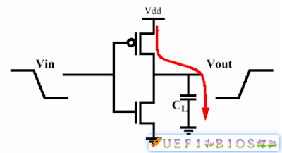
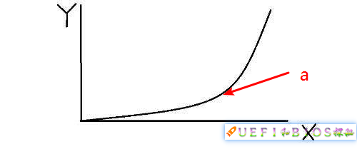
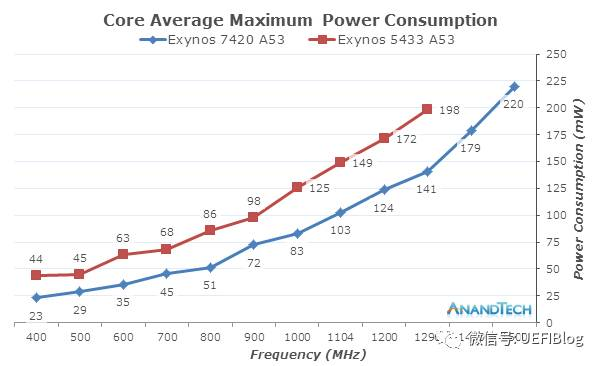
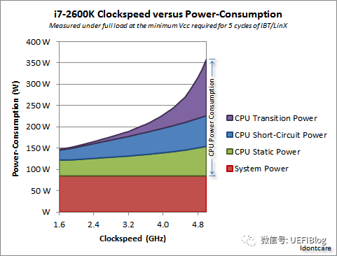

## **为什么CPU会发热**

从含有1亿4000万个场效应晶体管FET的奔腾4到高达80多亿的Kabylake，Intel忠实的按照摩尔定律增加着晶体管的数目。这么多个FET随着每一次的翻转都在消耗者能量。一个FET的简单示意图如下：

当输入低电平时，CL被充电，我们假设a焦耳的电能被储存在电容中。而当输入变成高电平后，这些电能则被释放，a焦耳的能量被释放了出来。因为CL很小，这个a也十分的小，几乎可以忽略不计。但如果我们以1GHz频率翻转这个FET，则能量消耗就是a × 10^9，这就不能忽略了，再加上CPU中有几十亿个FET，消耗的能量变得相当可观。

## **耗能和频率的关系**

从图示中，也许你可以直观的看出，能耗和频率是正相关的。这个理解很正确，实际上能耗和频率成线性相关。能耗关系公示是(参考资料2)：

P代表能耗。C可以简单看作一个常数，它由制程等因素决定；V代表电压；而f就是频率了。理想情况，提高一倍频率，则能耗提高一倍。看起来并不十分严重，不是吗？但实际情况却没有这么简单。

我们这里要引入门延迟（Gate Delay）的概念。简单来说，组成CPU的FET充放电需要一定时间，这个时间就是门延迟。只有在充放电完成后采样才能保证信号的完整性。而这个充放电时间和电压负相关，即电压高，则充放电时间就短。也和制程正相关，即制程越小，充放电时间就短。让我们去除制程的干扰因素，当我们不断提高频率f后，过了某个节点，太快的翻转会造成门延迟跟不上，从而影响数字信号的完整性，从而造成错误。这也是为什么超频到某个阶段会不稳定，随机出错的原因。那么怎么办呢？聪明的你也许想到了超频中常用的办法：加压。对了，可以通过提高电压来减小门延迟，让系统重新稳定下来。

让我们回头再来看看公式，你会发现电压和功耗可不是线性相关，而是平方的关系！再乘以f，情况就更加糟糕了。我们提高频率，同时不得不提高电压，造成P的大幅提高！我们回忆一下初中学过的y=x^3的函数图：

Y在经过前期缓慢的提高后在a点会开始陡峭的上升。这个a就是转折点，过了它，就划不来了。功耗和频率的关系也大抵如此，我们看两个实际的例子：

i7-2600K频率和功耗的关系

Exynos频率和功耗的关系

从ARM和X86阵营来看，他们能耗曲线是不是和幂函数图很像？

## **不可忽视的其他因素**

现实情况比这个更复杂。实际上，上面公式里的P只是动态能耗。CPU的整体功耗还包括短路功耗和漏电功耗：

短路功耗是在FET翻转时，有个极短时间会有电子直接跑掉。它和电压、频率正相关。

漏电功耗是电子穿透MOSFET的泄漏情况，它和制程与温度有关。

综合这些，我们看一个实际的例子：

这里的Transition Power就是动态能耗，可以看出它随着频率陡峭上升；短路功耗和频率几乎呈现线性关系；而Static power就是指漏电功耗，它也上升是因为频率上升导致温度上升，从而漏电加重。

我们这里引入热密度的概念，即单位面积发出热的数量。从此图看出，随着频率的提高，各种因素综合叠加导致功耗上升严重，而芯片尺寸不变，从而热密度提高很快，现有散热设备短时间内排不出这么多热量，就会造成死机等现象（[CPU风扇停转后会发生什么？CPU凭什么烧不坏](https://zhuanlan.zhihu.com/p/27624654)）。这也是为什么超频往往需要很好的散热设备的原因（[手把手来超频一：升级散热系统](https://zhuanlan.zhihu.com/p/27536834)）。