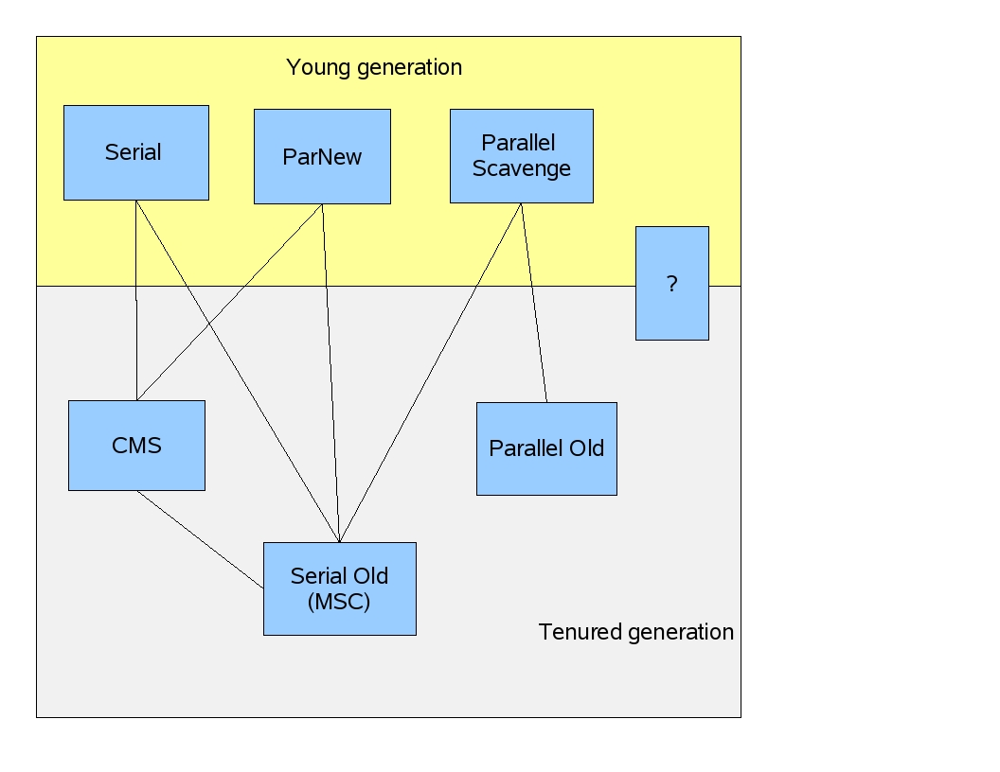

# Our Collectors

Guest Author

I drew this diagram on a white board for some customers recently. They seemed to like it (or were just being very polite) so I thought I redraw it for your amusement.

Each blue box represents a collector that is used to collect a generation. The young generation is collected by the blue boxes in the yellow region and the tenured generation is collected by the blue boxes in the gray region. 

"Serial" is a stop-the-world, copying collector which uses a single GC thread.
"ParNew" is a stop-the-world, copying collector which uses multiple GC threads. It differs from "Parallel Scavenge" in that it has enhancements that make it usable with CMS. For example, "ParNew" does the synchronization needed so that it can run during the concurrent phases of CMS.

"Parallel Scavenge" is a stop-the-world, copying collector which uses multiple GC threads.

"Serial Old" is a stop-the-world, mark-sweep-compact collector that uses a single GC thread.

"CMS" is a mostly concurrent, low-pause collector. 

"Parallel Old" is a compacting collector that uses multiple GC threads.

Using the -XX flags for our collectors for jdk6,

UseSerialGC is "Serial" + "Serial Old"

UseParNewGC is "ParNew" + "Serial Old"

UseConcMarkSweepGC is "ParNew" + "CMS" + "Serial Old". "CMS" is used most of the time to collect the tenured generation. "Serial Old" is used when a concurrent mode failure occurs.

UseParallelGC is "Parallel Scavenge" + "Serial Old"

UseParallelOldGC is "Parallel Scavenge" + "Parallel Old"

FAQ

1) UseParNew and UseParallelGC both collect the young generation using multiple GC threads. Which is faster?

There's no one correct answer for this questions. Mostly they perform equally well, but I've seen one do better than the other in different situations. If you want to use GC ergonomics, it is only supported by UseParallelGC (and UseParallelOldGC) so that's what you'll have to use.

2) Why doesn't "ParNew" and "Parallel Old" work together? 

"ParNew" is written in a style where each generation being collected offers certain interfaces for its collection. For example, "ParNew" (and "Serial") implements space_iterate() which will apply an operation to every object in the young generation. When collecting the tenured generation with
either "CMS" or "Serial Old", the GC can use space_iterate() to do some work on the objects in the young generation.
This makes the mix-and-match of collectors work but adds some burden to the maintenance of the collectors and to the addition of new
collectors. And the burden seems to be quadratic in the number of collectors.
Alternatively, "Parallel Scavenge" (at least with its initial implementation before "Parallel Old") always knew how the tenured generation was being collected and could call directly into the code in the "Serial Old" collector. 
"Parallel Old" is not written in the "ParNew" style so matching it with "ParNew" doesn't just happen without significant work.
By the way, we would like to match "Parallel Scavenge" only with "Parallel Old" eventually and clean up any of the ad hoc code needed for "Parallel Scavenge" to work with both.

Please don't think too much about the examples I used above. They are admittedly contrived and not worth your time.

3) How do I use "CMS" with "Serial"? 

-XX:+UseConcMarkSweepGC -XX:-UseParNewGC.
Don't use -XX:+UseConcMarkSweepGC and -XX:+UseSerialGC. Although that's seems like a logical combination, it will result in a message saying something about conflicting collector combinations and the JVM won't start. Sorry about that.
Our bad.

4) Is the blue box with the "?" a typo?

That box represents the new garbage collector that we're currently developing called Garbage First or G1 for short. G1 will provide:

 More predictable GC pauses

Better GC ergonomics

Low pauses without fragmentation

Parallelism and concurrency in collections

Better heap utilization

G1 straddles the young generation - tenured generation boundary because it is a generational collector only in the logical sense. G1 divides the
heap into regions and during a GC can collect a subset of the regions. 

It is logically generational because it dynamically selects a set of regions to act as a young generation which will then be collected at the next GC (as the young generation would be).

The user can specify a goal for the pauses and G1 will do an estimate (based on past collections) of how many regions can be collected in that time (the pause goal). 
That set of regions is called a collection set and G1 will collect it during the next GC.

G1 can choose the regions with the most garbage to collect first (Garbage First, get it?)
so gets the biggest bang for the collection buck.

G1 compacts so fragmentation is much less a problem. Why is it a problem at all?
There can be internal fragmentation due to partially filled regions.

The heap is not statically divided into a young generation and a tenured generation so the problem of an imbalance in their sizes is not there.

Along with a pause time goal the user can specify a goal on the fraction of time that can be spent on GC during some period (e.g., during the next 100 seconds don't spend more than 10 seconds collecting). For such goals (10 seconds of GC in a 100 second period) G1 can choose a collection set that it expects it can collect in 10 seconds and schedules the collection 90 seconds (or more) from the previous collection. You can see how an evil user could specify 0 collection time in the next century so again, this is just a goal, not a promise.

If G1 works out as we expect, it will become our low-pause collector in place of "ParNew" + "CMS". And if you're about to ask when will it be ready, please don't be offended by my dead silence. It's the highest priority project for our team, but it is software development so there are the usual unknowns. It will be out by JDK7. The sooner the better as far as we're concerned.

**Updated February 4.** Yes, I can edit an already posted blog. Here's a reference to the G1 paper if you have ACM portal access.

http://portal.acm.org/citation.cfm?id=1029879

