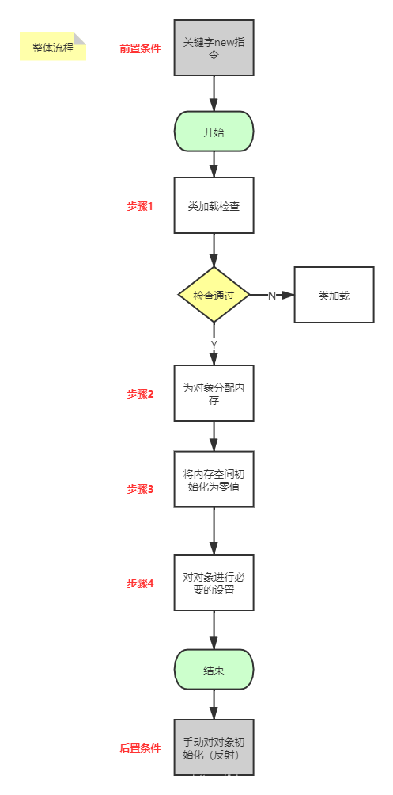
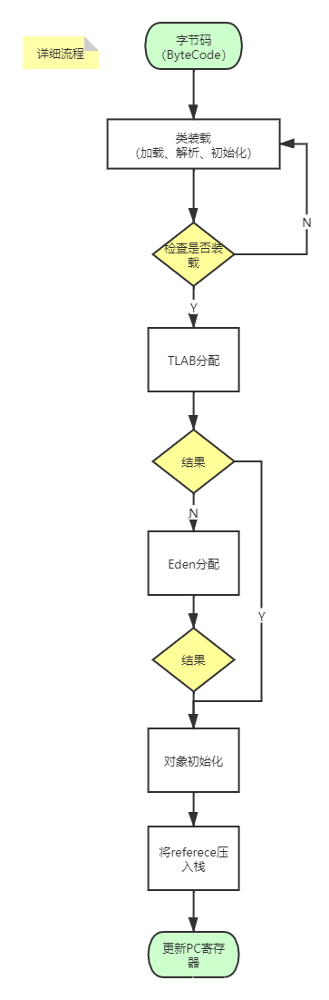
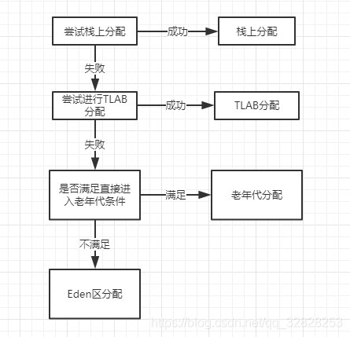

# JVM对象内存分配详细过程（栈上分配-＞TLAB-＞老年代-＞Eden区）

> 一个类创建实例的时候，需要经过多个步骤，比如我们调用new的时候经过了哪些流程，本文就来详细分析下

## 内存分配整体流程

### 步骤1

1. 检查该指令参数是否能够在**常量池中定位到这个类的符到引用**
2. 检查这个符号引用所代表的类**是否已加载、解析、初始化**。
3. 如果没有则执行类加载过程

### 步骤2

1. 内存分配根据java堆内存是否绝对规整，分为：

   指针碰撞

   &

   空闲列表

   1. **指针碰撞法：**
       假设堆中内存完整，一分配的内存和空闲内存分别在不同的一侧，这时通过一个指针为分界点，需要分配内存时将指针往空闲的一端移动与对象大小相等的距离，这样就完成了内存分配。
   2. **空闲列表法：**
       如果堆中内存不完整，已分配内存和空闲内存相互交错，JVM通过维护一个空闲列表记录可用内存块信息。当需要分配内存时，在列表中找到一个足够大的内存块分配给对象实例，并更新列表上的记录。

2. 解决线程安全问题   

   1. 当有多个线程都需要分配内存空间时，使用**CAS（Compare And Swap）+ 失败重试机制**
   2. 依据逃逸分析算法分配到线程或者堆上

### 步骤3

保证了对象的实例字段在使用时可不赋值就直接使用（对应值0，比如int、boolean）

### 步骤4

设置对象是哪个类的实例，并存放在对象的对象头中

## 内存分配详细流程

 其中TLAB是在满足逃逸分析算法后做JVM做的优化

## 内存分配位置尝试过程

 图中可以看到，优先在**栈上分配->TLAB->老年代->Eden区**

## 扩展

### 逃逸分析

逃逸分析其实就是分析java对象的动态作用域，

1. 如果一个对象被定义之后，被外部对象引用，则称之为`方法逃逸`
2. 如果被其它线程所引用，则称之为`线程逃逸`

如果经过以上分析，一个对象没有逃逸出方法的话（仅仅在方法内部引用），那么就可能被优化成栈上分配。

### 栈上分配和TLAB区别？

#### 栈上分配

优点：

1. 对象生命周期随着方法的调用开始而开始，结束而结束，不需要进行垃圾回收，**减轻了GC的负担**

#### TLAB（Thread Local Allocation Buffer）线程本地分配缓存

TLAB就是**线程私有的堆空间**，哪怕这个堆空间特别小（实际上时Eden区划分出来的），但只要有，每个线程分配对象到堆空间的时候会优先分配到线程自己所属的那一块堆空间中。

优点：

1. 线程私有的堆内存，可以很好的避免了共享堆中多个线程操作堆内存分配对象空间时产生的`同步问题`（虽然有CAS+失败重试），从而提高堆上对象分配的效率。

## 总结

通过以上分析，弄懂了关于对象内存分配的详细过程，通过对过程的分析也了解了一些深层次的知识，比如指针碰撞、空闲列表、栈上分配、TLAB等。也希望可以给阅读本文的小伙伴带来一些帮助吧