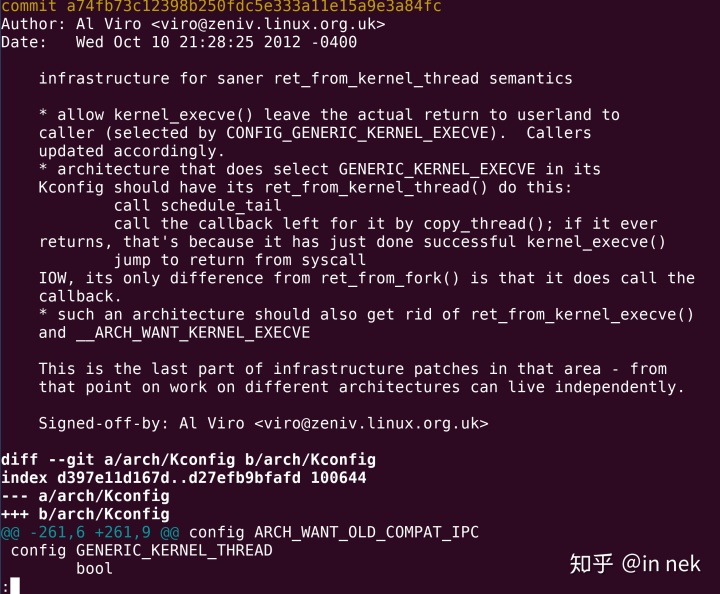

## [分享我的Linux内核开发环境](https://zhuanlan.zhihu.com/p/97246711)

[](https://www.zhihu.com/people/in-nek)

[「已注销」](https://www.zhihu.com/people/in-nek)

490 人赞同了该文章

这个文档本来是应该用来回答这个问题的：[有没有kernel开发人员愿意分享一下自己的开发环境？](https://www.zhihu.com/question/29778389/answer/917396704)。但我不喜欢提问者的态度，感觉回答他没啥意思（本来就不看重开发的人看了你热情的表述，只会更不想参与），但我喜欢有更多的人参与到Linux内核开发中来，所以我把回答写在这里。一般来说，如果你要正经参与Linux Kernel的开发，应该把Linux内核源代码下的Documentation/process目录的内容全部看一遍，Linux Kernel现在已经不是几年前那个水平了，Linux Kernel的流程文档水平相当高，大部分不清不楚的细节，都在这个目录中找到答案。所以，要正经参与开发，认真看一次，是必须的。我这里起的作用不是详细介绍这个方法和过程，而是给你归纳和形容一下一个Kernel开发者的日常和工作环境，以便部分还没有摸到边或者很多逻辑还没有组合在一起的爱好者可以明白整个逻辑链是怎么样的，帮助他们更快进入到实际的开发中来。我自己不是Kernel的Maintainer，但我是我们产品的构架师，所以很多我们的框架、驱动上传Linux主线之前要不是我搭的，要不是我参与设计的，我也不乏驱动、框架和Bugfixing的上传经验，所以基本上我对如何上传代码，如何和开发者交流，如何开发等等都有一定的经验，我也一直和其他的社区开发者有交流，对他们手中的开发环境也是有相当的认识的，算是代表一种比较主流专业内核开发者的意见吧。本文不能给你介绍什么是操作系统，什么是操作系统内核，这个你得自己有底。但基本上，我们可以认为操作系统内核其实就是一个大程序，一个把很多C文件编译链接在一起的大程序。硬件初始化（BIOS）后，就启动这个大程序，先汇编，然后进入C的主入口（start_kernel)，调用一个个模块的初始化，最后启动你的第一进程(init)，进入进程空间。之后就是init进程怎么请求内核，要求clone出更多的进程的问题了。如果你只是要编译调试内核，甚至没有init进程都是可以的，你就靠在你的模块里打印几句话。你也可以直接在你的模块中创建一个Socket，启动一个WebServer，这也无不可。所以，就算没有进程空间，把Linux内核看做是一个大程序，类似你刚学C语言时在用户空间里写一个程序，没有太大的不同。如果你刚刚开始进入这个开发，不需要搞懂所有的来龙去脉。你可以找一个目录，比如drivers/leds里面随便找一个文件，拷贝一份，仿照他写一个程序就可以尝试写一个模块，之后慢慢跟踪到其他地方就可以了。Linux内核数千万行的代码，连Linus自己都看不完，我们其实不需要都搞得懂。能编译，能运行，能加一段简单的模块代码，之后，拿着这个“大程序”，你对哪段有兴趣，我们就弄那一段就好了。甚至你都不用加代码，直接设个断点，看看某个系统调用怎么工作的都可以。现在虚拟机技术非常成熟，你可以把整个Linux Kernel运行在虚拟机里，好像运行一个普通的C程序一样，或者像调试一个本地程序一样，用gdb来单步跟踪。在你的PC上，你可以用qemu模拟一个硬件，然后启动你自己编译的内核，我这里有两个模拟方法：[in nek：怎样快速调试Linux内核zhuanlan.zhihu.com](https://zhuanlan.zhihu.com/p/26352997)[in nek：X86上的ARM Linux调试环境zhuanlan.zhihu.com](https://zhuanlan.zhihu.com/p/53325393)我个人推荐在PC上模拟ARM的环境，以我的经验，这样问题少很多，比如模拟x86很容易单步不下来，在ARM上就不会。x86的历史包袱太重了。当然我希望明年我们的ARM64 PC上市（真正的基于UEFI启动，支持SBSA，支持随便使用通用Linux发行版的PC，而不是一台大手机），我可以直接给你提供ARM to ARM的模拟，但其实对开发来说，我觉得基本上是没有区别的。现在开始介绍开发环境。我自己用的开发环境是Ubuntu，国内不少人喜欢CentOS，其实都无所谓，因为我们开发用到的环境基本上都在命令行上。无论用什么发行版，它的命令行都差不多的。不同的只是软件包的数量，针对不同硬件的持续支持好不好，Service管理方法组织方法之类的。我认识的很多Linux内核开发者基本上都是抱这样的态度选择发行版的。我看过Linus在Debian Conf上的一个Q&A，他也是类似的观点。开发一个Linux模块已经很忙了，谁有时间折腾那么多东西呢，谁会手工去配置一个Systemd的rule怎么写呢？越是深入研究一个技术，就越需要把非关键逻辑让给其他专业的人去做。所以我们需要的开发环境就是有足够大的团队维护，能持续修Bug，能持续增加硬件支持的，而不是够不够Cool的。关于该不该用Windows的问题，这种问题在我这里，包括我认识的很多开发者那里，都是不存在的。比如我，除了这些年送了一些出去，也不计算网上我可以访问的一堆IaaS的云服务，现在我手上还有3台Laptop，两台移动工作站，三台无头服务器（两台ARM一台x86的），所以Windows另外装就是了，只是Windows内核调试非常麻烦，常常要两台机器配合，又没有源代码，所以，我要研究验证个方案，我基本上都会用Linux虚拟机（或者真硬件），Windows的机器就很少有机会开了。总的来说，我觉得如果你是做Linux Kernel开发，又想融入社区，最好还是有一台独立的Baremetal装的Linux，后面你很快会看到这样做的好处的。我用i3wm做Window Manager。这个WM问题挺多的，但胜在省鼠标。操作i3wm基本上都不需要用鼠标。而我们做开发的，都希望命令直接从键盘上出去，懒得手离开键盘去摸鼠标，所以它的缺点也忍了。虽然内核开发者都用控制台工作，但我也现在很少看到有人用纯文本的界面。这背后的理由是：虽然我用控制台，但如果控制台上的程序需要绘制一个图形，也应该随时可以绘制，我们不用图形界面只是要用脚本和“不用动鼠标去精确定位一个点”的好处，并不是要限制自己不能绘图。所以，其实我的i3wm后台其实是开着gnome-setting-daemon之类的Daemon的。我不用gnome只是懒得动鼠标，并不是我不喜欢KDE或者GNOME的功能。中文输入法我现在用搜狗，但一般来说，除了写总结或者在这写博客，也不用中文。我大部分文档都用markdown或者reStructureText来写，所以vim就可以了，画图基本上是inkscape，控制力极强，基本只受限于我的绘图想象力。其他就都是命令行的东西了。gcc/binutils，gdb，make, tmux, vim, ctags, cscope, grep, find，bash，git，mutt， ssh, gpg， rsync，qemu，inkscape（这个不是命令行）。everyday的工具就这些了，其他编译内核必须的东西，你要编的时候发现没有自然会补上的，也不值得谈。下面看看我为什么用这些工具和怎么用这些工具的。gcc/binutils不用说了，你做C语言编程，这是必须的，而且这东西的功能谁用谁知道，真的是[控制力](https://zhuanlan.zhihu.com/p/97290505)极强：读出，写入任何一个段，转换格式，决定摆放地址，基本上可以随心所欲，为所欲为。这里要专门说说控制台问题。很多人觉得用控制台的要不是老古董，要不就是耍Cool，认为其实控制台没有图形界面好用，觉得图形界面是控制台的发展。这种想法其实没有做everyday的开发工作，不知道工作量都在什么地方。我举个例子，我要启动一个内核的调试，我用命令行的写法是这样的：
```
~/work/qemu-run-arm64/qemu/aarch64-softmmu/qemu-system-aarch64 \
        -s -cpu cortex-a57 -machine virt \
        -trace enable=wd_dummy_v2_* \
        -nographic -smp 1 -m 1024m -kernel arch/arm64/boot/Image \
        -device virtio-net-pci,netdev=net0 \
        -netdev type=user,id=net0,hostfwd=tcp::5555-:22 \
        -fsdev local,id=p9fs,path=$P9PATH,security_model=mapped \
        -device virtio-9p-pci,fsdev=p9fs,mount_tag=p9 \
        -append "console=ttyAMA0 uacce.dyndbg=+p wd_dummy2.dyndbg=+p debug"
```
这东西会成为我工作目录下的一个脚本，我根本不会记得它，你让我记住每次在图形界面上怎么点吗？也许你会觉得图形也可以有会话保存这样的功能，但那种功能要一个一个学的，怎么能和这种直接映射为一段文本并且语法上具有一致性的方案来比呢？实际上，我这个脚本完整是这样的：

```bash
#!/bin/sh

#if use drive which if=ide, set root to /dev/sda1
#if use drive which if=virtio, set root to /dev/vda1

P9PATH=~/work/xxxx-repo/xxxx/test

~/work/qemu-run-arm64/qemu/aarch64-softmmu/qemu-system-aarch64 \
	-s -cpu cortex-a57 -machine virt \
	-trace enable=wd_dummy_v2_* \
	-nographic -smp 1 -m 1024m -kernel arch/arm64/boot/Image \
	-device virtio-net-pci,netdev=net0 \
	-netdev type=user,id=net0,hostfwd=tcp::5555-:22 \
	-fsdev local,id=p9fs,path=$P9PATH,security_model=mapped \
	-device virtio-9p-pci,fsdev=p9fs,mount_tag=p9 \
	-append "console=ttyAMA0 uacce.dyndbg=+p wd_dummy2.dyndbg=+p debug"

#These are tested:
# with external image
#qemu-system-aarch64 -cpu cortex-a57 -machine virt \
#	-S -s \
#	-drive if=none,file=ubuntu-14.04-server-cloudimg-arm64-uefi1.img,id=hd0 \
#	-device virtio-blk-device,drive=hd0 \
#	-nographic -smp 1 -m 1024m -kernel arch/arm64/boot/Image \
#	-append "console=ttyAMA0 root=/dev/vda1 init=/bin/sh"
#
# with buildroot as initramfs
#qemu-system-aarch64 -cpu cortex-a57 -machine virt \
#	-nographic -smp 1 -m 1024m -kernel arch/arm64/boot/Image \
#	-device virtio-net-pci,netdev=net0 -netdev type=user,id=net0,hostfwd=tcp::5555-:22 \
#	-fsdev local,id=p9fs,path=p9root,security_model=mapped \
#	-device virtio-9p-pci,fsdev=p9fs,mount_tag=p9 \
#	-append "console=ttyAMA0"
#
# with a user net:
#	the dhcp address of the guest is 10.0.2.15,
#	proxy is 100.0.2.2
#	dhcp server is 10.0.2.3
# with hostfwd:
#	ssh to local port will be redirect to guest port
# with plan 9 filesystem, mount in guest by:
#	mount -t 9p -o trans=virtio p9 /mnt
```

这其实不但是一个脚本，也是一个笔记。脚本本质是一种“交流”语言，也是用Unix系统的控制力在多个物理实体和抽象层面上都可以生效的基础。如果要在图形界面上解决这样的问题，只有可能是你的会话也映射为一段代码的形式，但每个工具提供一种语言给我，我的学习成本也高啊。所以，说来说去，还不如直接给我控制台呢。我的Kernel目录下一堆的脚本：把内核编译成ARM版本的啊，把内核编译成x86的啊，用rsync同步到服务器上去啊，搜索所有的系统调用啊，统统都是脚本，写的时候查查命令的manpage，写完就基本上忘掉了（但要改的时候看看脚本我都能记回来），哪里有空记住那么多“功能”呢？甚至，我在一台机器上编译，拷贝到另一个机器上，然后调用那边的控制台，用某种参数执行这个程序。这也是脚本。因为，我们一旦把一个东西“语言化”，我们可以极大地提高我们的跨实体的“控制力”：[in nek：语言的控制力问题](https://zhuanlan.zhihu.com/p/97290505)所以，相应地，我们会喜欢vim这样的编辑器。我在大学里编程序用ultraEditor，刚工作的时候用Source Insight，但我现在只用vim。首先就是vim具有普适性，几乎在什么地方都能用，这本身就是个控制力的问题。更重要的是，大部分时候我连gvim都不用，因为我需要用vim来延续这种脚本控制力。你可以看看我的vimrc，我会有很多这样的脚本的：

```shell
command Gb e! ++enc=gb2312

if filereadable("cscope.out")
        cs add cscope.out
endif

if filereadable("vim.local")
	source vim.local
endif

if filereadable("build.sh")
	set makeprg=./build.sh
elseif filereadable("armbuild.sh")
	set makeprg=./armbuild.sh
elseif filereadable("x86build.sh")
	set makeprg=./x86build.sh
endif

command -nargs=+ Cgrep grep -Ir --include "*.[ch]" <args>
command -nargs=+ CSgrep grep -Ir --include "*.[chsS]" <args>

colorscheme elflord

command -range Sv <line1>,<line2>w! /tmp/g_vim_433291
command Lv r /tmp/g_vim_433291
map <C-D> :!sdcv <C-R><C-W><CR>
```
这其实都不是什么高大上的插件，完全就是我每次都要干的活（包括很多依赖控制台的命令），就直接包装一下，要不变成命令，要不变成自动化工具，这样工作起来效率就很高。很多人总想把vim包装成一个GUI界面，以证明vim其实是不错的。这种想法给人一种把飞机改造成高级轿车，把手枪改装成榔头的感觉，完全抓不住方向。vim的一般编辑功能也没有什么特别，主要好处就是热键多，而且因为分了模式，所以热键的选择范围大（但是结果就是方便，比如一键到行首，两键到特定的字符，这种操控感很多编辑工具都无法达到的）。但这个其实不算是什么优势，核心优势还是和其他脚本工具的无缝集成，比如我可以用:r !ls *.c直接把当前目录的C文件名读到我正在编辑的文件里，也可以用:'<,'>!sort把头文件列表排个序什么的，这才是它方便的地方。此外，特色功能上，我比较喜欢的有这么几个：ctl-p功能。就是写过的标识符，ctags中有的标识符，你个人字典中有的单词，都可以自动联想cfile功能。可以用任何脚本来搜索一个目录树，然后用cfile建立位置和结果的关联q脚本录制功能，我一般是用qq启动一个录制，然后开始做动作，做完以后用"10@q"来执行10次，这样可以做那种每行删除一个单词之类的功能ab功能其实也很好用，我以前做java开发经常用它生成例行代码（比如try catch代码块），但在Kernel开发上倒没有什么用其他就是怎么和脚本配合的问题了，说到底还是个控制力的问题，其他编辑器有太多的瓶颈越不过去了。很多人特别喜欢Source Insight一类的自动代码结构分析和找到代码变量位置的功能。这个如果做Kernel开发，vim其实是更实用的：首先，一般的代码结构分解vim可以配合ctags, cscope和global来解决，而更多时候，因为内核大量使用宏结构，还有不少自动生成的代码，还有很多代码在不同平台上有不同的版本，这用这些自动工具都不好使。这时反而find+grep是最有效的，再配合cfile功能，你爱怎么整理搜索结果就怎么整理。更关键的是，这些中间结果，都是受你控制的的“文本”，你很容易用vim本身去操纵这个文本，然后用awk，Python或者vim自己的:cfile去再次处理它，这保证了你每个工作量，都是可以被复用的。另外一个我喜欢用的技巧就是，找到某个文件位置后，我可以运行:e %:h，这是打开这个文件的目录的同级目录，这样我就可以分析这个目录本身的结构了，这才是一般理解一个代码结构的方式，很多GUI工具封装了调用结构，反而把文件本身的位置结构给丢失了，这又成为一个掌控力的问题。使用控制台常用的另一个工具就是tmux，用这个工具的核心原因是在连服务器的时候不担心断线。只要服务器没有关系，随时可以拿回原来的控制台。我经常还干的事情是在家里连云上的服务器，回到单位用另一台终端再连上去，然后把家里那个tmux控制台抢过来接着工作。原来家里开着四五个vim，还有gdb，输出终端，串口等等一堆窗口继续保留着，这也有种上帝般的操控感。下面这个是我用的tmux配置：
```bash
set-window-option -g mode-keys vi 
#set-window-option -g utf8 on 
#set-option -g status-utf8 on   

set-option -g prefix C-a 

#unbind-key C-b 
bind-key a send-prefix 
bind-key C-a last-window 
bind-key C-w last-pane       
bind -n M-Left select-pane -L 
bind -n M-Right select-pane -R 
bind -n M-Up select-pane -U 
bind -n M-Down select-pane -D 

bind-key c new-window -c "#{pane_current_path}" 
bind-key '"' split-window -c "#{pane_current_path}" 
bind-key % split-window -h -c "#{pane_current_path}" 

#enable mount 
set-option -g mouse on
```
你可以看到了，在tmux做编辑，也可以用vi的热键，其实我不用tmux，控制台的热键也是vi的，这是我的Inputrc：
```bash
set editing-mode vi 
set keymap vi 
set input-meta on 
set output-meta on 
set bell-style none
```
所以，你觉得学vim的成本很高，但和整个开发环境要用的一对比，你就会发现其实这个性价比是很高的。再说说git的使用，一般来说，我们用git就是保存修改历史。但现在git已经变成代码的一部分了（修改记录和里面的Commit Topic实际是一种代码注释），因为Linux内核对git的记录是有要求的，它要求每个特性修改，每个Bugfixing，都必须是一条记录，这样，我们很容易找到某个特性，某个错误，是什么时候引入的，我们随便打开一个文件，用git blame去看看它的修改记录，你就可以知道某段代码是谁写的，在那个补丁里面写进去的，为什么要写进去，比如这样：

这是kernel/kmod.c的每行修改记录，你可以看到，每个头文件是谁包含进去的，在哪个补丁包含进入的，都是可以找到的。比如你这里看到Al Viro包含了ptrace.h，你不知道他为什么要加这个，你可以看看他当时提交的补丁：git show a74fb73：



所以，通常我们把开发过程和提交过程是分开来管理的。比如你要开发一个新功能，你可以git clone一个最新的内核分支，然后git co -b一个新的分支，在那里随便修改，每天都可以git commit记录历史，等你搞定了。你可以再git co -b一个新的分支，然后git rebase -i，把这个commit序列重新整理一遍，然后提交给你的上游。如果上游不同意，你可以继续修改，然后再git rebase -i，重新整理这个序列，再次提交……所以，最终你发到主线上去的序列，其实是有逻辑的，每个commit是独立解决一个问题的。另一个常用的功能是git worktree，这可以省点空间，我当前用于Kernel开发的工作目录是57G，同一个内核，我需要开不同的分支，编译成ARM的，x86的，RISCV的不同版本，worktree可以保证你只有一个目录是有历史记录的，其他只是一个Snapshot，这管理起来方便很多。Kernel还有很多脚本用于帮助你自动发现错误（比如用的最多的scripts/check_patch.pl），这个前面提到的内核文档中有详细的描述，我这里就不多说了。我个人框架代码都是用qemu调试的，如果对硬件有依赖，也用qemu模拟一个硬件设备来调试，调试的时候通过make menuconfig把kernel hacking菜单下死锁检查，内存调试这些功能开了，就能看到主要的问题，其他工具用得不多。单位的CI系统会用到kernel test这些测试套，那是正式商业交付的时候才需要的了。如果要写复杂的驱动，这时用qemu就不好使的，但基本上我会先在PC上把编译，构架调整做了，然后对关键函数都打桩做完单元测试，然后才上单板调试，一般除非硬件Bug太多，否则大部分问题我都可以依靠我驱动本身的调试功能（流程统计，ftrace跟踪点等），直接把问题定位出来，所以我依赖硬件的时间其实是很短的。大部分工作还是天天和我的本地控制台打交道。最后谈谈mutt，mutt又是一个命令行工具，它是一个邮件客户端，很多人看着这个界面肯定是不爽的，我也觉得这个客户端挺落后的，但在Linux Kernel开发中，它还是很好用，暂时我是找不着有什么工具能很好取代它的。首先不知道大家有没有注意到，email协议其实是个文本协议，如果你直接telnet到你的pop3服务器上，你就能直接用文本和它互动，你觉得互相独立的什么发件人，收件人，其实都是一段原始的文本，好比这样：
```
Message-ID: <55F0E6D6.9060308@xxxxxxxx.com>
Date: Thu, 10 Sep 2015 10:11:34 +0800
From: XXXXX <xxx.xxxxx@xxxxxxx.com>                                       
User-Agent: Mozilla/5.0 (Windows NT 6.1; rv:17.0) Gecko/20130509 Thunderbird/17.0.6 MIME-Version: 1.0
To: xxxx                                       
CC: xxxx
```
如果你发的是有格式的文本，或者一段视频出去。邮件服务器只是把邮件的内容包装成特殊的本文或者html来发送而已。所以，Linux Kernel的所有邮件，都要求是没有二进制的文本文件，因为这个邮件本身，就是可以作为一个Patch，直接合入我的一个配置库的。而且，Linux Kernel的开发者之间，通过前面这些to, cc的域来标识一个Patch的属性，比如你可以在里面加上Acked-by，来说明自己支持这个补丁，或者你可以加上Tested-by，说明你这个补丁有谁测试过。如果这些Acked和Tested的人在社区的声誉好，地位高，你的补丁被接受的可能性就会高很多。所以Linux Kernel社区的交流方式常常是这样的：我写好了一个修改，通过git rebase -i重整了我的commit序列，然后我用git format-patch生成一组补丁，然后修改其中的0号补丁（这不是一个commit，而是一个称为cover-letter的总结邮件），在里面说明白我这个补丁集（Patch Set）的来龙去脉，然后就发送给上游的维护者（如果是正式修改，需要同时抄送到各个涉及的邮件列表，具体抄送给谁，内核有一个叫scripts/get_maintainer.pl的脚本帮你发现的）这个维护者用mutt收到这个补丁了，他可以选择他们，存到一个mailbox里面（这其实仍是一个文本文件），然后用git am直接合入自己的一个分支上：


然后他就可以Review或者测试这个补丁了。所以Linux Kernel的所有技术讨论，修改过程，如果你要看，在Internet上都有，就看你有没有耐心了。在邮件列表上，来自世界各地的人可以给你Comment，可以对你的邮件提供Acked-By，Tested-By等等的支持，最后有相关的Maintainer接纳，最后合入Linus Torvards手上的主线，然后被其他千千万万的公司，学校，个人开发者重新Clone出来，用于自己的用户。在一个完全没有强制约束的网络上，实现这样一个快速开发的工程，这堪称人类工程的奇迹的。Mutt的作用就是，这些文本有关的东西都是暴露的，你可以任意自由选择多个文本，调用其他程序进行预处理，或者存成一个mbox（所谓mbox就是多个邮件的文本cat在一起），进行单独的保存，分发，或者用git am合入git库中。对于邮件文本的处理，提醒一个可能很多人都忽略的工具特性：gzip压缩是无头的，也就是说，如果你有很多邮件，你可以一个个gzip压缩，然后直接cat到一起，得到的新文件也是gzip的。因为gzip是没有文件头的。这种方法经常用来处理mutt的邮件，mailbox，但实际上它可以用于处理任何需要逐步压缩的情形。总的来说吧，Linux Kernel开发是个全文本，以掌控，高效为目的的开发环境。表面上看来它一点都不Cool，但它就是高效和专业的。你要这样想：一个一大堆工程师开发的，目的就是给自己用的，不要考虑怎么给其他用户宣传的平台，怎么可能不高效？