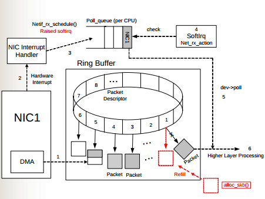

# Linux服务器丢包故障的解决思路及引申的TCP/IP协议栈理论							

​									

我们使用Linux作为服务器操作系统时，为了达到高并发处理能力，充分利用机器性能，经常会进行一些内核参数的调整优化，但不合理的调整常常也会引起意想不到的其他问题，本文就一次Linux服务器丢包故障的处理过程，结合Linux内核参数说明和TCP/IP协议栈相关的理论，介绍一些常见的丢包故障定位方法和解决思路。

# 问题现象

本次故障的反馈现象是：从办公网访问公网服务器不稳定，服务器某些端口访问经常超时，但Ping测试显示客户端与服务器的链路始终是稳定低延迟的。

通过在服务器端抓包，发现还有几个特点：

- 从办公网访问服务器有多个客户端，是同一个出口IP，有少部分是始终能够稳定连接的，另一部分间歇访问超时或延迟很高
- 同一时刻的访问，无论哪个客户端的数据包先到达，服务端会及时处理部分客户端的SYN请求，对另一部分客户端的SYN包“视而不见”，如tcpdump数据所示，源端口为56909的SYN请求没有得到响应，同一时间源端口为50212的另一客户端SYN请求马上得到响应。

Shell

$ sudo tcpdump -i eth0 port 22 and "tcp[tcpflags] & (tcp-syn) != 0" 18:56:37.404603 IP CLIENT.56909 > SERVER.22: Flags [S], seq 1190606850, win 29200, options [mss 1448,sackOK,TS val 198321481 ecr 0,nop,wscale 7], length 0 18:56:38.404582 IP CLIENT.56909 > SERVER.22: Flags [S], seq 1190606850, win 29200, options [mss 1448,sackOK,TS val 198321731 ecr 0,nop,wscale 7], length 0 18:56:40.407289 IP CLIENT.56909 > SERVER.22: Flags [S], seq 1190606850, win 29200, options [mss 1448,sackOK,TS val 198322232 ecr 0,nop,wscale 7], length 0 18:56:44.416108 IP CLIENT.56909 > SERVER.22: Flags [S], seq 1190606850, win 29200, options [mss 1448,sackOK,TS val 198323234 ecr 0,nop,wscale 7], length 0 18:56:45.100033 IP CLIENT.50212 > SERVER.22: Flags [S], seq 4207350463, win 65535, options [mss 1366,nop,wscale 5,nop,nop,TS val 821068631 ecr 0,sackOK,eol], length 0 18:56:45.100110 IP SERVER.22 > CLIENT.50212: Flags [S.], seq 1281140899, ack 4207350464, win 27960, options [mss 1410,sackOK,TS val 1709997543 ecr 821068631,nop,wscale 7], length 0 18:56:52.439086 IP CLIENT.56909 > SERVER.22: Flags [S], seq 1190606850, win 29200, options [mss 1448,sackOK,TS val 198325240 ecr 0,nop,wscale 7], length 0 18:57:08.472825 IP CLIENT.56909 > SERVER.22: Flags [S], seq 1190606850, win 29200, options [mss 1448,sackOK,TS val 198329248 ecr 0,nop,wscale 7], length 0 18:57:40.535621 IP CLIENT.56909 > SERVER.22: Flags [S], seq 1190606850, win 29200, options [mss 1448,sackOK,TS val 198337264 ecr 0,nop,wscale 7], length 0 18:57:40.535698 IP SERVER.22 > CLIENT.56909: Flags [S.], seq 3621462255, ack 1190606851, win 27960, options [mss 1410,sackOK,TS val 1710011402ecr 198337264,nop,wscale 7], length 0

| 1234567891011 | $ sudo tcpdump -i eth0 port 22 and "tcp[tcpflags] & (tcp-syn) != 0"18:56:37.404603 IP CLIENT.56909 > SERVER.22: Flags [S], seq 1190606850, win 29200, options [mss 1448,sackOK,TS val 198321481 ecr 0,nop,wscale 7], length 018:56:38.404582 IP CLIENT.56909 > SERVER.22: Flags [S], seq 1190606850, win 29200, options [mss 1448,sackOK,TS val 198321731 ecr 0,nop,wscale 7], length 018:56:40.407289 IP CLIENT.56909 > SERVER.22: Flags [S], seq 1190606850, win 29200, options [mss 1448,sackOK,TS val 198322232 ecr 0,nop,wscale 7], length 018:56:44.416108 IP CLIENT.56909 > SERVER.22: Flags [S], seq 1190606850, win 29200, options [mss 1448,sackOK,TS val 198323234 ecr 0,nop,wscale 7], length 018:56:45.100033 IP CLIENT.50212 > SERVER.22: Flags [S], seq 4207350463, win 65535, options [mss 1366,nop,wscale 5,nop,nop,TS val 821068631 ecr 0,sackOK,eol], length 018:56:45.100110 IP SERVER.22 > CLIENT.50212: Flags [S.], seq 1281140899, ack 4207350464, win 27960, options [mss 1410,sackOK,TS val 1709997543 ecr 821068631,nop,wscale 7], length 018:56:52.439086 IP CLIENT.56909 > SERVER.22: Flags [S], seq 1190606850, win 29200, options [mss 1448,sackOK,TS val 198325240 ecr 0,nop,wscale 7], length 018:57:08.472825 IP CLIENT.56909 > SERVER.22: Flags [S], seq 1190606850, win 29200, options [mss 1448,sackOK,TS val 198329248 ecr 0,nop,wscale 7], length 018:57:40.535621 IP CLIENT.56909 > SERVER.22: Flags [S], seq 1190606850, win 29200, options [mss 1448,sackOK,TS val 198337264 ecr 0,nop,wscale 7], length 018:57:40.535698 IP SERVER.22 > CLIENT.56909: Flags [S.], seq 3621462255, ack 1190606851, win 27960, options [mss 1410,sackOK,TS val 1710011402ecr 198337264,nop,wscale 7], length 0 |
| ------------- | ------------------------------------------------------------ |
|               |                                                              |

# 排查过程

服务器能正常接收到数据包，问题可以限定在两种可能：部分客户端发出的数据包本身异常；服务器处理部分客户端的数据包时触发了某种机制丢弃了数据包。因为出问题的客户端能够正常访问公网上其他服务，后者的可能性更大。

有哪些情况会导致Linux服务器丢弃数据包？

## 防火墙拦截

服务器端口无法连接，通常就是查看防火墙配置了，虽然这里已经确认同一个出口IP的客户端有的能够正常访问，但也不排除配置了DROP特定端口范围的可能性。

## 如何确认

查看iptables filter表，确认是否有相应规则会导致此丢包行为：

Shell

$ sudo iptables-save -t filter

| 1    | $ sudo iptables-save -t filter |
| ---- | ------------------------------ |
|      |                                |

这里容易排除防火墙拦截的可能性。

## 连接跟踪表溢出

除了防火墙本身配置DROP规则外，与防火墙有关的还有连接跟踪表nf_conntrack，Linux为每个经过内核网络栈的数据包，生成一个新的连接记录项，当服务器处理的连接过多时，连接跟踪表被打满，服务器会丢弃新建连接的数据包。

**如何确认**
 通过dmesg可以确认是否有该情况发生：

Shell

$ dmesg |grep nf_conntrack

| 1    | $ dmesg \|grep nf_conntrack |
| ---- | --------------------------- |
|      |                             |

如果输出值中有“nf_conntrack: table full, dropping packet”，说明服务器nf_conntrack表已经被打满。

通过/proc文件系统查看nf_conntrack表实时状态：

Shell

\# 查看nf_conntrack表最大连接数 $ cat /proc/sys/net/netfilter/nf_conntrack_max 65536 # 查看nf_conntrack表当前连接数 $ cat /proc/sys/net/netfilter/nf_conntrack_count 7611

| 123456 | # 查看nf_conntrack表最大连接数$ cat /proc/sys/net/netfilter/nf_conntrack_max65536# 查看nf_conntrack表当前连接数$ cat /proc/sys/net/netfilter/nf_conntrack_count7611 |
| ------ | ------------------------------------------------------------ |
|        |                                                              |

当前连接数远没有达到跟踪表最大值，排除这个因素。

**如何解决**

如果确认服务器因连接跟踪表溢出而开始丢包，首先需要查看具体连接判断是否正遭受DOS攻击，如果是正常的业务流量造成，可以考虑调整nf_conntrack的参数：

nf_conntrack_max决定连接跟踪表的大小，默认值是65535，可以根据系统内存大小计算一个合理值：CONNTRACK_MAX = RAMSIZE(in bytes)/16384/(ARCH/32)，如32G内存可以设置1048576；

nf_conntrack_buckets决定存储conntrack条目的哈希表大小，默认值是nf_conntrack_max的1/4，延续这种计算方式：BUCKETS = CONNTRACK_MAX/4，如32G内存可以设置262144；

nf_conntrack_tcp_timeout_established决定ESTABLISHED状态连接的超时时间，默认值是5天，可以缩短到1小时，即3600。

Shell

$ sysctl -w net.netfilter.nf_conntrack_max=1048576 $ sysctl -w net.netfilter.nf_conntrack_buckets=262144 $ sysctl -w net.netfilter.nf_conntrack_tcp_timeout_established=3600

| 123  | $ sysctl -w net.netfilter.nf_conntrack_max=1048576$ sysctl -w net.netfilter.nf_conntrack_buckets=262144$ sysctl -w net.netfilter.nf_conntrack_tcp_timeout_established=3600 |
| ---- | ------------------------------------------------------------ |
|      |                                                              |

## Ring Buffer溢出

排除了防火墙的因素，我们从底向上来看Linux接收数据包的处理过程，首先是网卡驱动层。

如下图所示，物理介质上的数据帧到达后首先由NIC（网络适配器）读取，写入设备内部缓冲区Ring  Buffer中，再由中断处理程序触发Softirq从中消费，Ring  Buffer的大小因网卡设备而异。当网络数据包到达（生产）的速率快于内核处理（消费）的速率时，Ring  Buffer很快会被填满，新来的数据包将被丢弃。
 

**如何确认**
 通过ethtool或/proc/net/dev可以查看因Ring Buffer满而丢弃的包统计，在统计项中以fifo标识：

Shell

$ ethtool -S eth0|grep rx_fifo rx_fifo_errors: 0 $ cat /proc/net/dev Inter-|   Receive                                                |  Transmit  face |bytes    packets errs drop fifo frame compressed multicast|bytes    packets errs drop fifo colls carrier compressed  eth0: 17253386680731 42839525880    0    0    0     0          0 244182022 14879545018057 41657801805    0    0    0     0       0         0

| 1234567 | $ ethtool -S eth0\|grep rx_fiforx_fifo_errors: 0$ cat /proc/net/devInter-\|  Receive                        \| Transmit face \|bytes  packets errs drop fifo frame compressed multicast\|bytes  packets errs drop fifo colls carrier compressed eth0: 17253386680731 42839525880  0  0  0   0     0 244182022 14879545018057 41657801805  0  0  0   0    0     0 |
| ------- | ------------------------------------------------------------ |
|         |                                                              |

可以看到服务器的接收方向的fifo丢包数并没有增加，这里自然也排除这个原因。
 **如何解决**
 如果发现服务器上某个网卡的fifo数持续增大，可以去确认CPU中断是否分配均匀，也可以尝试增加Ring Buffer的大小，通过ethtool可以查看网卡设备Ring Buffer最大值，修改Ring Buffer当前设置：

Shell

\# 查看eth0网卡Ring Buffer最大值和当前设置 $ ethtool -g eth0 Ring parameters for eth0: Pre-set maximums: RX:     4096    RX Mini:    0 RX Jumbo:   0 TX:     4096    Current hardware settings: RX:     1024    RX Mini:    0 RX Jumbo:   0 TX:     1024    # 修改网卡eth0接收与发送硬件缓存区大小 $ ethtool -G eth0 rx 4096 tx 4096 Pre-set maximums: RX:     4096    RX Mini:    0 RX Jumbo:   0 TX:     4096    Current hardware settings: RX:     4096    RX Mini:    0 RX Jumbo:   0 TX:     4096

| 1234567891011121314151617181920212223242526 | # 查看eth0网卡Ring Buffer最大值和当前设置$ ethtool -g eth0Ring parameters for eth0: Pre-set maximums:RX:   4096  RX Mini:  0RX Jumbo:  0TX:   4096  Current hardware settings:RX:   1024  RX Mini:  0RX Jumbo:  0TX:   1024  # 修改网卡eth0接收与发送硬件缓存区大小$ ethtool -G eth0 rx 4096 tx 4096Pre-set maximums:RX:   4096  RX Mini:  0RX Jumbo:  0TX:   4096  Current hardware settings:RX:   4096  RX Mini:  0RX Jumbo:  0TX:   4096 |
| ------------------------------------------- | ------------------------------------------------------------ |
|                                             |                                                              |

## netdev_max_backlog溢出

netdev_max_backlog是内核从NIC收到包后，交由协议栈（如IP、TCP）处理之前的缓冲队列。每个CPU核都有一个backlog队列，与Ring  Buffer同理，当接收包的速率大于内核协议栈处理的速率时，CPU的backlog队列不断增长，当达到设定的netdev_max_backlog值时，数据包将被丢弃。

**如何确认**
 通过查看/proc/net/softnet_stat可以确定是否发生了netdev backlog队列溢出：

Shell

$ cat /proc/net/softnet_stat 01a7b464 00000000 00000000 00000000 00000000 00000000 00000000 00000000 00000000 00000000 00000000 01d4d71f 00000000 00000000 00000000 00000000 00000000 00000000 00000000 00000000 00000000 00000000 0349e798 00000000 00000000 00000000 00000000 00000000 00000000 00000000 00000000 00000000 00000000 017e0826 00000000 00000000 00000000 00000000 00000000 00000000 00000000 00000000 00000000 00000000

| 12345 | $ cat /proc/net/softnet_stat01a7b464 00000000 00000000 00000000 00000000 00000000 00000000 00000000 00000000 00000000 0000000001d4d71f 00000000 00000000 00000000 00000000 00000000 00000000 00000000 00000000 00000000 000000000349e798 00000000 00000000 00000000 00000000 00000000 00000000 00000000 00000000 00000000 00000000017e0826 00000000 00000000 00000000 00000000 00000000 00000000 00000000 00000000 00000000 00000000 |
| ----- | ------------------------------------------------------------ |
|       |                                                              |

其中：
 每一行代表每个CPU核的状态统计，从CPU0依次往下；
 每一列代表一个CPU核的各项统计：第一列代表中断处理程序收到的包总数；第二列即代表由于netdev_max_backlog队列溢出而被丢弃的包总数。
 从上面的输出可以看出，这台服务器统计中，并没有因为netdev_max_backlog导致的丢包。

**如何解决**
 netdev_max_backlog的默认值是1000，在高速链路上，可能会出现上述第二列统计不为0的情况，可以通过修改内核参数net.core.netdev_max_backlog来解决：

Shell

$ sysctl -w net.core.netdev_max_backlog=2000

| 1    | $ sysctl -w net.core.netdev_max_backlog=2000 |
| ---- | -------------------------------------------- |
|      |                                              |

## 反向路由过滤

反向路由过滤机制是Linux通过反向路由查询，检查收到的数据包源IP是否可路由（Loose mode）、是否最佳路由（Strict mode），如果没有通过验证，则丢弃数据包，设计的目的是防范IP地址欺骗攻击。rp_filter提供了三种模式供配置：

- 0 - 不验证
- 1 - RFC3704定义的严格模式：对每个收到的数据包，查询反向路由，如果数据包入口和反向路由出口不一致，则不通过
- 2 - RFC3704定义的松散模式：对每个收到的数据包，查询反向路由，如果任何接口都不可达，则不通过

**如何确认**
 查看当前rp_filter策略配置：

Shell

$ cat /proc/sys/net/ipv4/conf/eth0/rp_filter 0

| 12   | $ cat /proc/sys/net/ipv4/conf/eth0/rp_filter0 |
| ---- | --------------------------------------------- |
|      |                                               |

如果这里设置为1，就需要查看主机的网络环境和路由策略是否可能会导致客户端的入包无法通过反向路由验证了。

从原理来看这个机制工作在网络层，因此，如果客户端能够Ping通服务器，就能够排除这个因素了。

**如何解决**
 根据实际网络环境将rp_filter设置为0或2：

Shell

$ sysctl -w net.ipv4.conf.all.rp_filter=2 或 $ sysctl -w net.ipv4.conf.eth0.rp_filter=2

| 12345 | $ sysctl -w net.ipv4.conf.all.rp_filter=2 或 $ sysctl -w net.ipv4.conf.eth0.rp_filter=2 |
| ----- | ------------------------------------------------------------ |
|       |                                                              |

## 半连接队列溢出

半连接队列指的是TCP传输中服务器收到SYN包但还未完成三次握手的连接队列，队列大小由内核参数tcp_max_syn_backlog定义。

当服务器保持的半连接数量达到tcp_max_syn_backlog后，内核将会丢弃新来的SYN包。

**如何确认**
 通过dmesg可以确认是否有该情况发生：

Shell

$ dmesg | grep "TCP: drop open request from"

| 1    | $ dmesg \| grep "TCP: drop open request from" |
| ---- | --------------------------------------------- |
|      |                                               |

半连接队列的连接数量可以通过netstat统计SYN_RECV状态的连接得知

Shell

$ netstat -ant|grep SYN_RECV|wc -l 0

| 12   | $ netstat -ant\|grep SYN_RECV\|wc -l0 |
| ---- | ------------------------------------- |
|      |                                       |

大多数情况下这个值应该是0或很小，因为半连接状态从第一次握手完成时进入，第三次握手完成后退出，正常的网络环境中这个过程发生很快，如果这个值较大，服务器极有可能受到了SYN Flood攻击。

**如何解决**
 tcp_max_syn_backlog的默认值是256，通常推荐内存大于128MB的服务器可以将该值调高至1024，内存小于32MB的服务器调低到128，同样，该参数通过sysctl修改：

Shell

$ sysctl -w net.ipv4.tcp_max_syn_backlog=1024

| 1    | $ sysctl -w net.ipv4.tcp_max_syn_backlog=1024 |
| ---- | --------------------------------------------- |
|      |                                               |

另外，上述行为受到内核参数tcp_syncookies的影响，若启用syncookie机制，当半连接队列溢出时，并不会直接丢弃SYN包，而是回复带有syncookie的SYC+ACK包，设计的目的是防范SYN Flood造成正常请求服务不可用。

Shell

$ sysctl -w net.ipv4.tcp_syncookies=1 net.ipv4.tcp_syncookies = 1

| 12   | $ sysctl -w net.ipv4.tcp_syncookies=1net.ipv4.tcp_syncookies = 1 |
| ---- | ------------------------------------------------------------ |
|      |                                                              |

## PAWS

PAWS全名Protect Againest Wrapped Sequence numbers，目的是解决在高带宽下，TCP序列号在一次会话中可能被重复使用而带来的问题。
 
 如上图所示，客户端发送的序列号为A的数据包A1因某些原因在网络中“迷路”，在一定时间没有到达服务端，客户端超时重传序列号为A的数据包A2，接下来假设带宽足够，传输用尽序列号空间，重新使用A，此时服务端等待的是序列号为A的数据包A3，而恰巧此时前面“迷路”的A1到达服务端，如果服务端仅靠序列号A就判断数据包合法，就会将错误的数据传递到用户态程序，造成程序异常。

PAWS要解决的就是上述问题，它依赖于timestamp机制，理论依据是：在一条正常的TCP流中，按序接收到的所有TCP数据包中的timestamp都应该是单调非递减的，这样就能判断那些timestamp小于当前TCP流已处理的最大timestamp值的报文是延迟到达的重复报文，可以予以丢弃。在上文的例子中，服务器已经处理数据包Z，而后到来的A1包的timestamp必然小于Z包的timestamp，因此服务端会丢弃迟到的A1包，等待正确的报文到来。

PAWS机制的实现关键是内核保存了Per-Connection的最近接收时间戳，如果加以改进，就可以用来优化服务器TIME_WAIT状态的快速回收。

TIME_WAIT状态是TCP四次挥手中主动关闭连接的一方需要进入的最后一个状态，并且通常需要在该状态保持2*MSL（报文最大生存时间），它存在的意义有两个：

1.可靠地实现TCP全双工连接的关闭：关闭连接的四次挥手过程中，最终的ACK由主动关闭连接的一方（称为A）发出，如果这个ACK丢失，对端（称为B）将重发FIN，如果A不维持连接的TIME_WAIT状态，而是直接进入CLOSED，则无法重传ACK，B端的连接因此不能及时可靠释放。

2.等待“迷路”的重复数据包在网络中因生存时间到期消失：通信双方A与B，A的数据包因“迷路”没有及时到达B，A会重发数据包，当A与B完成传输并断开连接后，如果A不维持TIME_WAIT状态2*MSL时间，便有可能与B再次建立相同源端口和目的端口的“新连接”，而前一次连接中“迷路”的报文有可能在这时到达，并被B接收处理，造成异常，维持2*MSL的目的就是等待前一次连接的数据包在网络中消失。

TIME_WAIT状态的连接需要占用服务器内存资源维持，Linux内核提供了一个参数来控制TIME_WAIT状态的快速回收：tcp_tw_recycle，它的理论依据是：

在PAWS的理论基础上，如果内核保存Per-Host的最近接收时间戳，接收数据包时进行时间戳比对，就能避免TIME_WAIT意图解决的第二个问题：前一个连接的数据包在新连接中被当做有效数据包处理的情况。这样就没有必要维持TIME_WAIT状态2*MSL的时间来等待数据包消失，仅需要等待足够的RTO（超时重传），解决ACK丢失需要重传的情况，来达到快速回收TIME_WAIT状态连接的目的。

但上述理论在多个客户端使用NAT访问服务器时会产生新的问题：同一个NAT背后的多个客户端时间戳是很难保持一致的（timestamp机制使用的是系统启动相对时间），对于服务器来说，两台客户端主机各自建立的TCP连接表现为同一个对端IP的两个连接，按照Per-Host记录的最近接收时间戳会更新为两台客户端主机中时间戳较大的那个，而时间戳相对较小的客户端发出的所有数据包对服务器来说都是这台主机已过期的重复数据，因此会直接丢弃。

**如何确认**
 通过netstat可以得到因PAWS机制timestamp验证被丢弃的数据包统计：

Shell

$ netstat -s |grep -e "passive connections rejected because of time stamp" -e "packets rejects in established connections because of timestamp” 387158 passive connections rejected because of time stamp 825313 packets rejects in established connections because of timestamp

| 123  | $ netstat -s \|grep -e "passive connections rejected because of time stamp" -e "packets rejects in established connections because of timestamp”387158 passive connections rejected because of time stamp825313 packets rejects in established connections because of timestamp |
| ---- | ------------------------------------------------------------ |
|      |                                                              |

通过sysctl查看是否启用了tcp_tw_recycle及tcp_timestamp:

Shell

$ sysctl net.ipv4.tcp_tw_recycle net.ipv4.tcp_tw_recycle = 1 $ sysctl net.ipv4.tcp_timestamps net.ipv4.tcp_timestamps = 1

| 1234 | $ sysctl net.ipv4.tcp_tw_recyclenet.ipv4.tcp_tw_recycle = 1$ sysctl net.ipv4.tcp_timestampsnet.ipv4.tcp_timestamps = 1 |
| ---- | ------------------------------------------------------------ |
|      |                                                              |

这次问题正是因为服务器同时开启了tcp_tw_recycle和timestamps，而客户端正是使用NAT来访问服务器，造成启动时间相对较短的客户端得不到服务器的正常响应。

**如何解决**
 如果服务器作为服务端提供服务，且明确客户端会通过NAT网络访问，或服务器之前有7层转发设备会替换客户端源IP时，是不应该开启tcp_tw_recycle的，而timestamps除了支持tcp_tw_recycle外还被其他机制依赖，推荐继续开启：

Shell

$ sysctl -w net.ipv4.tcp_tw_recycle=0 $ sysctl -w net.ipv4.tcp_timestamps=1

| 12   | $ sysctl -w net.ipv4.tcp_tw_recycle=0$ sysctl -w net.ipv4.tcp_timestamps=1 |
| ---- | ------------------------------------------------------------ |
|      |                                                              |

# 结论

Linux提供了丰富的内核参数供使用者调整，调整得当可以大幅提高服务器的处理能力，但如果调整不当，就会引进莫名其妙的各种问题，比如这次开启tcp_tw_recycle导致丢包，实际也是为了减少TIME_WAIT连接数量而进行参数调优的结果。我们在做系统优化时，时刻要保持辩证和空杯的心态，不盲目吸收他人的果，而多去追求因，只有知其所以然，才能结合实际业务特点，得出最合理的优化配置。