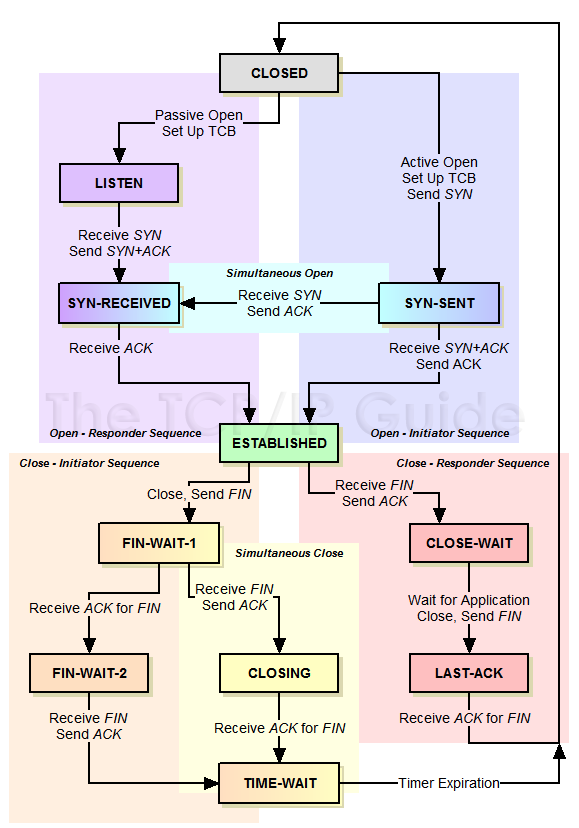
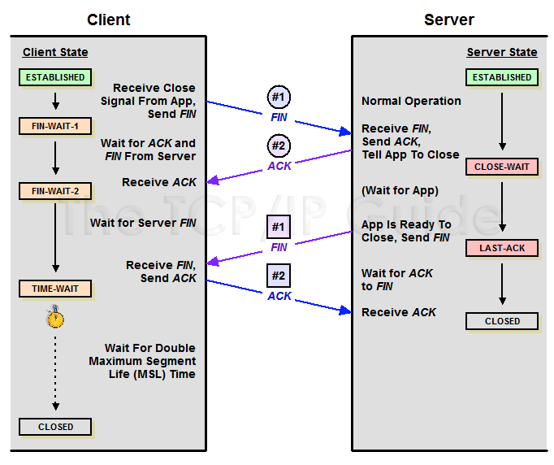
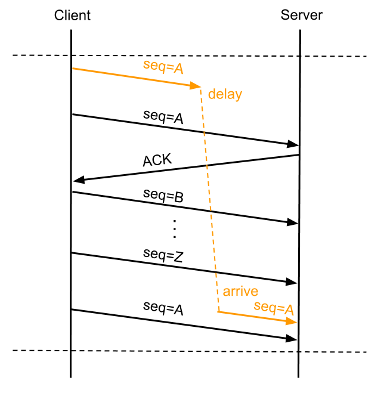
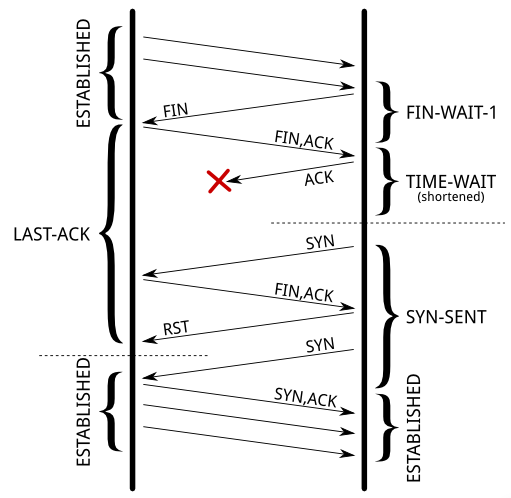

# TCP TIME-WAIT

Jun 30, 2017 |  Hits

TIME-WAIT 是 TCP 挥手过程的一个状态。很多地方都对它有说明，这里只贴两个图唤起记忆。下面是 TCP 完整的状态图：

[](https://ylgrgyq.github.io/2017/06/30/tcp-time-wait/TCP-State.png)来自：http://www.tcpipguide.com/free/t_TCPOperationalOverviewandtheTCPFiniteStateMachineF-2.htm

看到最下面有个 TIME-WAIT 状态。状态图可能看着不那么直观，可以看这个：

[](https://ylgrgyq.github.io/2017/06/30/tcp-time-wait/TCP-Fin.png)来自：http://www.tcpipguide.com/free/t_TCPConnectionTermination-2.htm

上面实际不一定是只有 Client 才能进入 TIME-WAIT 状态，而是谁发起 TCP 连接断开先发的 FIN，谁最终就进入 TIME-WAIT 状态。

## TIME-WAIT 的作用

第一个作用是避免上一个连接延迟到达的数据包被下一个连接错误接收。如下图所示：

[](https://ylgrgyq.github.io/2017/06/30/tcp-time-wait/TIME-WAIT-Function.png)来自：https://vincent.bernat.im/en/blog/2014-tcp-time-wait-state-linux

虚线将两次连接分开，两次连接都使用的同一组 TCP Tuple，即 Source IP, Source Port, Destination IP, Destination Port 组合。第一次连接中 SEQ 为 3 的数据包出现了重发，第二次连接中刚好再次使用 SEQ 为 3  这个序号的时候，第一次连接中本来发丢(延迟)的 SEQ 为 3 的数据包在此时到达，就导致这个延迟了的 SEQ 为 3  的数据包被当做正确的数据而接收，之后如果还有 SEQ 为 3 的正常数据包到达会被接收方认为是重复数据包而直接丢弃，导致 TCP  连接接收的数据错误。

这种错误可能看上去很难发生，因为必须 TCP Tuple 一致，并且 SEQ 号*必须 valid* 时才会发生，但在高速网络下发生的可能性会增大(因为 SEQ 号会很快被耗尽而出现折叠重用)，所以需要有个 TIME-WAIT 的存在减少上面这种情况的发生，并且 TIME-WAIT 的长度还要长一些， [RFC 793 - Transmission Control Protocol](https://tools.ietf.org/html/rfc793) 要求 TIME-WAIT 长度要大于两个 MSL ([Maximum segment lifetime - Wikipedia](https://en.wikipedia.org/wiki/Maximum_segment_lifetime)) 。MSL 是人为定下的值，就认为数据包在网络路由的时间不会超过这么长。等足两个 MSL 以保证上图第二次连接建立的时候之前发丢的 SEQ 为 3 的数据包已经在网络中丢失，不可能再出现在第二次连接中。

另一个作用是被动断开连接的一方，发出最后一个 FIN 之后进入 LAST ACK 状态。主动断开连接的一方在收到 FIN 之后回复  ACK，如果该 ACK 发丢了，被动断开连接的一方会一直处在 LAST ACK 状态，并在超时之后重发 FIN。主动断开连接的一方如果处在  TIME WAIT 状态，重复收到 FIN 后每次会重发 ACK。但如果 TIME WAIT 时间短，会进入 CLOSED 状态，此时再收到  FIN 就直接回复 RST 了。这个 RST 会导致被动断开连接的一方有个错误提示，虽然所有数据实际已经成功发到对端。

这里有个疑问，如果连接断开后 TIME WAIT 时间很短，TIME WAIT 结束之后主动断开连接一方直接发出 SYN  而被动断开连接一方还处在 LAST ACK 状态，因为 SYN 是其不期待的数据会不会触发其回复 RST 导致主动断开连接一方 connect  失败而放弃建立连接？[这篇文章](https://vincent.bernat.im/en/blog/2014-tcp-time-wait-state-linux) 说如果开启 TCP Timestamp 后处在 LAST ACK 一方会丢弃 SYN 不会回复 RST 而是等到 FIN 超时后重发  FIN，从而让主动断开连接一方回复 RST 后再次发起 SYN 最终能保证连接正常建立。但依据是哪里？在下面介绍 tcp_tw_recycle  的地方会对 Linux 内收到数据包的过程做一下梳理，但从目前来看如果连接处在 LAST ACK，收到 SYN 后如果数据包没有损坏，SEQ  号也符合要求等等各种检查都能通过，则连接什么都不会做，相当于忽略了这个 SYN，也就是说不管 TCP TImestamp 是否开启，处在  LAST ACK 时收到 SYN 都不做任何事情。

## TIME WAIT 带来的问题

先引用一个名言：

```
The TIME_WAIT state is our friend and is there to help us (i.e., to let old duplicate segments expire in the network). Instead of trying to avoid the state, we should understand it.
```


据说这话的是 W. Richard Stevens 说的。也就是说 TIME WAIT  可能会给我们带来一些问题，但我们还是不要把它当成敌人，当成一个异常状态想方设法的去破坏它的正常工作，而是去利用它，理解它，让它为我们所用。这里要说 TIME WAIT 的问题只是需要我们去理解它的副作用，不是说 TIME WAIT 真的就很邪恶很讨厌。

TIME WAIT 带来的问题主要是三个：

1. 端口占用，导致新的连接可能没有可用的端口;
2. TIME WAIT 状态的连接依然会占用系统内存;
3. 会带来一些 CPU 开销

对于第一个问题可以考虑开启下面说的 tcp_tw_reuse 甚至 tcp_tw_recycle，也能调大  net.ipv4.ip_local_port_range 以获取更多的可用端口，还可以使用多个 IP 或 Server 开启多个 port  的方法来避免没有端口可用的情况。

对于内存上的开销，进入 TIME WAIT 后应用层实际已经将连接相关信息销毁了，只是在 kernel 还维护有连接相关信息，所以内存占用只发生在 kernel 内。正常状态下的 Socket 结构比较复杂，[可以看看这里 struct tcp_sock](http://elixir.free-electrons.com/linux/v4.11.8/source/include/linux/tcp.h#L144)，它里面使用的是[struct inet_connection_sock](http://elixir.free-electrons.com/linux/v4.11.8/source/include/net/inet_connection_sock.h#L88)。Linux 为了减少 TIME WAIT 连接的开销，专门构造了更精简的 Socket 数据结构给进入 TIME WAIT 状态的连接用，参看[这里 struct tcp_timewait_sock](http://elixir.free-electrons.com/linux/v4.11.8/source/include/linux/tcp.h#L397) ，它里面用的是[inet_timewait_sock](http://elixir.free-electrons.com/linux/v4.11.8/source/include/net/inet_timewait_sock.h#L39)。可以看到 TIME WAIT 状态下连接的结构要比正常连接数据结构简单不少，在内核的数据结构最多百来字节，即使有 65535 个 TIME WAIT 的连接存在也占不了多少内存，几十 M 最多了。

对于 CPU 的开销一般也不大，主要是在建立连接时[在 inet_csk_get_port 函数内查找一个可用端口上的开销](http://elixir.free-electrons.com/linux/v4.11.8/source/net/ipv4/inet_connection_sock.c#L282)。

所以 TIME WAIT 带来的最主要的副作用就是会占用端口，而端口数量有限，可能导致无法创建新连接的情况。

## 减少 TIME WAIT 占用端口的方法

### SO_LINGER

对于应用层来说调用 `send()` 后数据并没有实际写入网络，而是先放到一个 buffer 当中，之后慢慢的往网络上写。所以会出现应用层想要关闭一个连接时，连接的 buffer 内还有数据没写出去，需要等待这部分数据写出。调用 `close()` 后等待 buffer 内数据全部写出去的时间叫做 Linger Time。Linger Time 结束后开始正常的 TCP 挥手过程。

从前面介绍能看到，正常的主动断开连接一定会进入 TIME WAIT 状态，但除了正常的连接关闭之外还有非正常的断开连接的方法，可以不让连接进入 TIME WAIT 状态。方法就是给 Socket 配置 SO_LIGNER，这样在调用 `close()` 关闭连接的时候主动断开连接一方不是等待 buffer 内数据发完之后再发送 FIN 而是根据 SO_LINGER  参数配置的超时时间，等到最多这个超时时间这么长后，如果连接 buffer 内还有数据就直接发送 RST 强制重置连接，对方会收到  Connection Reset by peer 的错误，同时会导致主动断开连接一方所有还未来得及发送的数据全部丢弃。如果还未到  SO_LINGER 配置的超时时间连接 buffer 内的数据就全部发完了，就还是发 FIN 走正常挥手逻辑，但这样主动断开连接一方还是会进入  TIME WAIT。所以如果主动断开连接时完全不想让连接进入 TIME WAIT 状态，可以直接将 SO_LINGER 设置为 0 ，这样调用 `close()` 后会直接发 RST，丢弃 buffer 内所有数据，并让连接直接进入 CLOSED 状态。

从上面描述也能看出来其应用场景可能会比较狭窄。看到[有地方](http://www.serverframework.com/asynchronousevents/2011/01/time-wait-and-its-design-implications-for-protocols-and-scalable-servers.html)建议是说收到错误数据，或者连接超时的时候通过这种方式直接重置连接，避免有问题的连接还进入 TIME WAIT 状态。

### tcp_tw_reuse、 tcp_tw_recycle 配置和 TCP Timestamp

为了介绍这两个配置，首先需要介绍一下 TCP Timestamp 机制。

[RFC 1323](https://tools.ietf.org/html/rfc1323) 和 [RFC 7323](https://tools.ietf.org/html/rfc7323) 提出过一个优化，在 TCP option 中带上两个 timestamp 值：
TCP Timestamps option (TSopt):
Kind: 8
Length: 10 bytes

```
+-------+-------+---------------------+---------------------+
|Kind=8 |  10   |   TS Value (TSval)  |TS Echo Reply (TSecr)|
+-------+-------+---------------------+---------------------+
    1       1              4                     4
```


TCP 握手时，通信双方如果都带有 TCP Timestamp 则表示双方都支持 TCP Timestamp 机制，之后每个 TCP  包都需要将自己当前机器时间带在 TSval 中，并且在每次收到对方 TCP 包做 ACK 回复的时候将对方的 TSval 作为 ACK 中  TSecr 字段返回给对方。这样通信双方就能在收到 ACK 的时候读取 TSecr 值并根据当前自己机器时间计算 TCP Round Trip  Time，从而根据网络状况动态调整 TCP 超时时间，以提高 TCP 性能。**请注意这个 option 虽然叫做 Timestamp 但不是真实日期时间，而是一般跟操作系统运行时间相关的一个持续递增的值**。更进一步信息请看 RFC 的链接。

除了对 TCP Round Trip 时间做测量外，这个 timestamp 还有个功能就是避免重复收到数据包影响正常的 TCP 连接，这个功能叫做 PAWS，在上面 RFC 中也有介绍。

#### PAWS (Protection Against Wrapped Sequences)

从 PAWS 的全名上大概能猜想出来它是干什么的。正常来说每个 TCP 包都会有自己唯一的 SEQ，出现 TCP 数据包重传的时候会复用 SEQ  号，这样接收方能通过 SEQ 号来判断数据包的唯一性，也能在重复收到某个数据包的时候判断数据是不是重传的。但是 TCP 这个 SEQ  号是有限的，一共 32 bit，SEQ 开始是递增，溢出之后从 0 开始再次依次递增。所以当 SEQ 号出现溢出后单纯通过 SEQ  号无法标识数据包的唯一性，某个数据包延迟或因重发而延迟时可能导致连接传递的数据被破坏，比如：

[](https://ylgrgyq.github.io/2017/06/30/tcp-time-wait/TCP-Delay.png)来自:http://www.sdnlab.com/17530.html

上图 A 数据包出现了重传，并在 SEQ 号耗尽再次从 A 递增时，第一次发的 A 数据包延迟到达了  Server，这种情况下如果没有别的机制来保证，Server 会认为延迟到达的 A 数据包是正确的而接收，反而是将正常的第三次发的 SEQ 为 A 的数据包丢弃，造成数据传输错误。PAWS 就是为了避免这个问题而产生的。在开启 Timestamp 机制情况下，一台机器发的所有 TCP 包的 TSval 都是单调递增的，PAWS 要求连接双方维护最近一次收到的数据包的 TSval 值，每收到一个新数据包都会读取数据包中的 TSval 值跟 Recent TSval 值做比较，如果发现收到的数据包 TSval 没有递增，则直接丢弃这个数据包。对于上面图中的例子有了 PAWS  机制就能做到在收到 Delay 到达的 A 号数据包时，识别出它是个过期的数据包而将其丢掉。[tcp_peer_is_proven 是 Linux 一个做 PAWS 检查的函数](http://elixir.free-electrons.com/linux/v4.11.8/source/net/ipv4/tcp_metrics.c#L576)。

TCP Timestamp 就像是 SEQ 号的扩展一样，用以在 SEQ 号相同时候判断两个数据包是否相同以及他们的先后关系。TCP  Timestamp 时间跟系统运行时间相关，但并不完全对应，也不需要 TCP 通信双方时间一致。Timestamp  的起跳粒度可以由系统实现决定，粒度不能太粗也不能太细。粒度最粗至少要保证 SEQ 耗尽的时候 Timestamp 跳了一次，从而在 SEQ  号重复的时候能通过 Timestamp 将数据包区分开。Timestamp 跳的粒度越细，能支持的最大发送速度越高。TCP SEQ 是 32  bit，全部耗尽需要发送 2^32 字节的数据（[RFC 7323 说是 2^31 字节数据](https://tools.ietf.org/html/rfc7323#section-5.4)，我还没弄明白为什么不是 2^32)，如果 Timestamp 一分钟跳一次，那支持的最高发送速度是一分钟发完 2^32 字节数据；如果 Timestamp  一秒钟跳一次，那支持的最高发送速度是一秒钟发完 2^32 字节数据。另外，Timestamp 因为担负着测量 RTT  的职责，过粗的粒度也会降低探测精度，不能达到效果。

但是 Timestamp 本身也是有限的，一共 32 bit，Timestamp  跳的粒度越细，跳的越快，被耗尽的速度也越快。越短时间被耗尽越会出现和只靠 SEQ  来判断数据包唯一性相同的问题场景，即收到一个延迟到达的数据包后无法确认它是正常数据包还是延迟数据包。所以一般推荐 Timestamp 是 1ms 或 1s 一跳。假若是 1ms 一跳的话能支持最高 8 Tbps 的传输速度，也能在长达 24.8 天才会被耗尽。只要 MSL ([Maximum segment lifetime - Wikipedia](https://en.wikipedia.org/wiki/Maximum_segment_lifetime)) 小于 24.8 天，通过 TCP Timestamp 机制就能拒绝同一个连接上 SEQ 相同的重复数据包。MSL 大于 24.8  天几乎不可能，一个延迟的数据包在 24.8 天后到达接收方，该数据包的 SEQ 、Timestamp  又恰好和一个正常数据包相同，这个概率非常的小。MSL 相关可以参看[RFC 793](http://www.rfc-editor.org/rfc/rfc793.txt) 。

TCP Timestamp 机制开启之后 PAWS 会自动开启，控制 TCP Timestamp 的配置为 `net.ipv4.tcp_timestamps` 一般现在 Linux 系统都是开启的。因为能提升 TCP 连接性能，付出的代价相对又少。该配置看着叫 ipv4 但对 ipv6 一样有效。

```
Linux 上有几个跟 PAWS 相关的统计信息：
    LINUX_MIB_PAWSPASSIVEREJECTED,      /* PAWSPassiveRejected */
    LINUX_MIB_PAWSACTIVEREJECTED,       /* PAWSActiveRejected */
    LINUX_MIB_PAWSESTABREJECTED,        /* PAWSEstabRejected */
```

PAWS passive rejected 是 tcp_tw_recycle 开启后，收到 Client 的 SYN 时，因为 SYN 内的 Timestamp 没有通过 PAWS 检测而被拒绝的 SYN 数据包数量。这个稍后再说。
PAWS active rejected 是 Client 发出 SYN 后，收到 Server 的 SYN/ACK 但 SYN/ACK 中的 Timestamp 没有通过 PAWS 检测而被拒绝的 SYN/ACK 数据包数量。
PAWS established rejected 是正常建立连接后，因为数据包没有通过 PAWS 检测而被拒绝的数据包数量。

这三个定义在一起的，在[uapi/linux/snmp.h 下](http://elixir.free-electrons.com/linux/v4.11.8/source/include/uapi/linux/snmp.h#L180)，下面会再次介绍这些计数是什么场景下被记录的。

目前来看 netstat -s 中只展示了 PAWS established rejected 的值，另外两个没展示，需要到 `/proc/net/netstat` 中看：

```
358306 packets rejects in established connections because of timestamp
```

#### net.ipv4.tcp_tw_reuse

需要注意的是这里说的 net.ipv4.tcp_tw_reuse 和下面说的 net.ipv4.tcp_tw_recycle 都是虽然名字里有 ipv4 但对 ipv6 同样生效。

只有开启了 PAWS 机制之后开启 net.ipv4.tcp_tw_reuse 才有用，并且仅对 outgoing 的连接有效，即仅对 Client 有效。Linux 中使用到 tcp_tw_reuse 的地方[是 tcp_twsk_unique 函数](http://elixir.free-electrons.com/linux/v4.11.8/source/net/ipv4/tcp_ipv4.c#L111)。[它是在 __inet_check_established 内被使用](http://elixir.free-electrons.com/linux/v4.11.8/source/net/ipv4/inet_hashtables.c#L315)，其作用是在 Client 连 Server 的时候如果已经没有端口可以使用，并且在 Client 端找到个处在 Time Wait 状态的和 Server 的连接，[只要当前时间和该连接最后一次收到数据的时间差值超过 1s](http://elixir.free-electrons.com/linux/v4.11.8/source/net/ipv4/tcp_ipv4.c#L129)，就能立即复用该连接，不用等待连接 Time Wait 结束。

前面说过 Time Wait 有两个作用，一个是避免同一个 TCP Tuple 上前一个连接的数据包错误的被后一个连接接收。因为有了  PAWS 机制，TCP 收到的数据会检查 TSval 是否大于最近一次收到数据的  TSval，所以这种情况不会发生。旧连接的数据包到达接收方后因为 PAWS 检测不通过会直接被丢弃，并更新  LINUX_MIB_PAWSESTABREJECTED 计数。

另一个作用是避免主动断开连接一方最后一个回复的 ACK 丢失而被动断开连接一方一直处在 LAST ACK 状态，超时后会再次发 FIN  到主动断开连接一方。此时如果主动断开连接一方不在 Time Wait 会触发主动断开连接一方发出 RST 让被动连接一方出现一个  Connection reset by peer 的报错。不过这个实际上还好，数据至少都发完了。如果被动断开连接一方还未因超时而重发 FIN  就收到主动断开连接一方因为 tcp_tw_reuse 提前从 TIME WAIT 状态退出而发出的 SYN，被动连接一方会立即重发  FIN，主动连接一方收到 FIN 后回复 RST，之后再重发 SYN 开始正常的 TCP 握手。后一个过程图如下：

[](https://ylgrgyq.github.io/2017/06/30/tcp-time-wait/tcp_tw_reuse.png)来自：https://vincent.bernat.im/en/blog/2014-tcp-time-wait-state-linux

[这篇文章](https://vincent.bernat.im/en/blog/2014-tcp-time-wait-state-linux) 说没有开启 TCP Timestamp 时，被动断开连接一方处在 LAST_ACK 状态，收到 SYN 后会回复 RST；开启了 TCP  Timestamp 之后，被动连接一方处在 LAST_ACK 状态收到 SYN 会丢弃这个 SYN，在 FIN 超时后再次发 FIN,  ACK，这里我有些疑惑。不明白为什么 TCP Timestamp 开启之后处在 LAST ACK 状态的一方就会默认丢弃对方发来的  SYN。PAWS 只有 Timestamp 不和要求时才会丢消息，但同一台机器上没有重启的话 TSval 是逐步递增的，[SEQ 号也是在原来 TIME WAIT 时存下的 SEQ 号基础上加一个偏移值得到](http://elixir.free-electrons.com/linux/latest/source/net/ipv4/tcp_ipv4.c#L130)，按说没有理由会自动丢弃 SYN 的。

还一个要注意到的是 tcp_tw_reuse 在 reuse 连接的时候[新创建的连接会复用之前连接保存的最近一次收到数据的 Timestamp](http://elixir.free-electrons.com/linux/latest/source/net/ipv4/tcp_ipv4.c#L133)。这个是与下面要说的 tcp_tw_recycle  的不同点，也是为什么 tcp_tw_reuse 在使用了 NAT 的网络下是安全的，而  tcp_tw_recycle 在使用了 NAT 的网络下是不安全的。因为 tcp_tw_reuse 记录的最近一次收到数据的 Timestamp 是针对 Per-Connection 的，而 tcp_tw_recycle 记录的最近一次收到数据的 Timestamp 是 Per-Host 的，在 NAT 存在的情况下同一个 Host 后面有多少机器就说不清了，每台机器时间不同发出数据包的 TSval 也不同，PAWS  可能错误的将正常的数据包丢弃所以会导致问题，这个在下面描述 tcp_tw_recycle 的时候再继续说。

从上面描述来看 tcp_tw_reuse 还是比较安全的，一般是建议开启。不过该配置对 Server 没有用，因为只有 outgoing 的连接才会使用。每次 reuse 一个连接后会将 TWRecycled 计数加一，通过 netstat -s 能看到：

```
7212 time wait sockets recycled by time stamp
```

虽然叫做 TWRecycled 但实际它指的是 reuse 的连接数，不是下面要说的 recycled 的连接数。其反应的是 LINUX_MIB_TIMEWAITRECYCLED 这个计数，在[__inet_check_established 内 reuse TIME WAIT 连接后计数](http://elixir.free-electrons.com/linux/v4.11.8/source/net/ipv4/inet_hashtables.c#L362)

#### net.ipv4.tcp_tw_recycle

该配置也是要基于 TCP Timestamp，单独开启 tcp_tw_recycle 没有效果。相对 tcp_tw_reuse 来说 tcp_tw_recycle 是个更激进的参数，这个参数在 Linux 的使用参看：
[linux/net/ipv4/tcp_input.c - Elixir - Free Electrons](http://elixir.free-electrons.com/linux/v4.11.8/source/net/ipv4/tcp_input.c#L6348)
[linux/net/ipv4/tcp_minisocks.c - Elixir - Free Electrons](http://elixir.free-electrons.com/linux/v4.11.8/source/net/ipv4/tcp_minisocks.c#L91)
[linux/net/ipv4/tcp_ipv4.c - Elixir - Free Electrons](http://elixir.free-electrons.com/linux/v4.11.8/source/net/ipv4/tcp_ipv4.c#L144)

##### 理一下 TCP 收消息过程

为了说清楚 tw_recycle 的使用场景，我准备把接收消息过程理一遍，可能会写的比较啰嗦，看的时候需要静下心来慢慢看。

首先链路层收到 TCP IPv4 的数据后会走到 [tcp_v4_rcv](http://elixir.free-electrons.com/linux/v4.11.8/source/net/ipv4/tcp_ipv4.c#L1605)  这里，看到参数是 struct sk_buff，以后有机会记录一下，NIC 从链路接收到数据写入 Ring Buffer 后就会构造这个 struct sk_buff，并且之后在数据包的处理过程中一直复用同一个 sk_buff，避免内存拷贝。

tcp_v4_rct 首先是进行各种数据包的校验，根据数据包的 source，dst 信息找到 Socket，是个[struct sock 结构](http://elixir.free-electrons.com/linux/v4.11.8/source/include/net/sock.h#L311)。我们这里主要说 TIME WAIT，所以别的东西都先不管。主要是看到下面会调用 [tcp_v4_do_rcv](http://elixir.free-electrons.com/linux/v4.11.8/source/net/ipv4/tcp_ipv4.c#L1732)。在 tcp_v4_do_rcv 内会开始真的处理 sk_buff 数据内容，如果连接不是 ESTABLSHED，也不是 LISTEN 会走到 [tcp_rcv_state_process](http://elixir.free-electrons.com/linux/v4.11.8/source/net/ipv4/tcp_ipv4.c#L1443)函数，这个函数是专门处理 TCP 连接各种状态转换的。还是那句话，我们关心的是 TIME WAIT，所以别的也都不看，先看连接的状态转换。我们知道连接先是在  FIN-WAIT-1，收到对方 ACK 后进入 FIN-WAIT-2，再收到对方 FIN 后进入 TIME-WAIT。在  tcp_rcv_state_process 先找到[ FIN-WAIT-1 这个 case](http://elixir.free-electrons.com/linux/v4.11.8/source/net/ipv4/tcp_input.c#L6009)，这里先会检查 acceptable 是否置位，表示收到的 sk_buff 内 ACK flag 是置位的，如果没有置位会立即返回 1 表示状态有误，之后会发 RST。即在 FIN-WAIT-1 状态下，连接期待的数据必须设置 ACK Flag，没设置就立即发 RST 重置连接。

如果一切正常，则[将连接状态设置为 FIN-WAIT-2](http://elixir.free-electrons.com/linux/v4.11.8/source/net/ipv4/tcp_input.c#L6033)，并读取 sysctl 的 net.ipv4.tcp_fin_timeout 配置。如果 sk_buff 中没有同时设置 FIN 说明对方是先回复了  ACK，让当前连接线进入 FIN-WAIT-2，FIN 在之后的包中发过来。所以此时设置连接状态并 discard 当前  sk_buff。这里有些疑问，此时连接实际是 Half-Open 的，这里没有判断 ACK 内有没有别的数据就把 sk_buff 丢弃了，从  RFC 793 中似乎没看到说要求针对 FIN 的 ACK 内必须不能有数据。接着说，看到用 [tcp_time_wait 函数](http://elixir.free-electrons.com/linux/v4.11.8/source/net/ipv4/tcp_input.c#L6064)将 tw_substate 设置到 FIN-WAIT-2 ，将连接设置为 TIME WAIT，并设置超时时间是 net.ipv4.tcp_fin_timeout 的值。稍后再继续说 tcp_time_wait 这个函数，还有很多可以挖掘的。

如果 sk_buff 同时设置了 FIN，说明对方是将 FIN 和 ACK 一起发来的，同一个数据包中 FIN 和 ACK 两个 Flag 都置位，[此时并不立即设置 TCP 连接的状态](http://elixir.free-electrons.com/linux/v4.11.8/source/net/ipv4/tcp_input.c#L6055)，而是在稍后在专门处理 FIN 的逻辑中处理 TCP 状态变换。如果 FIN 和 ACK 一起设置了，不会 discard 数据包，再往下还有个  case，要注意到有个 switch 的 Fall through，也就是说连接不管在 CLOSE_WAIT, CLOSING,  FIN_WAIT1, FIN_WAIT2, ESTALISHED 等最终都会进入 [tcp_data_queue](http://elixir.free-electrons.com/linux/v4.11.8/source/net/ipv4/tcp_input.c#L6112) 来继续处理这个收到的 sk_buff。在 tcp_data_queue 中我们看到[带着 FIN 的 sk_buff 会交给专门的 tcp_fin](http://elixir.free-electrons.com/linux/v4.11.8/source/net/ipv4/tcp_input.c#L4644) 来处理。因为在 tcp_rcv_state_process 内我们刚刚将连接状态设置为 TCP_FIN_WAIT2 所以在 tcp_fin 的 [switch 内我们找到 TCP_FIN_WAIT2 的处理逻辑](http://elixir.free-electrons.com/linux/v4.11.8/source/net/ipv4/tcp_input.c#L4065)，即回复 ACK 并通过 tcp_time_wait 函数设置 tw_substate 为 TCP_TIME_WAIT ，将连接设置为 TIME WAIT 状态，并设置超时时间是 0。

接下来我们看看 [tcp_time_wait 函数](http://elixir.free-electrons.com/linux/v4.11.8/source/net/ipv4/tcp_minisocks.c#L257) ，这个函数完成了将连接转换到 TIME WAIT 状态的逻辑。如果 tw_recycle 、TCP Timestamp 开启，[会先 Per-Host 的缓存连接最后一次收到数据的对方 TSval](http://elixir.free-electrons.com/linux/v4.11.8/source/net/ipv4/tcp_minisocks.c#L266)。将连接从普通的 struct sock 转换为 TIME WAIT 状态下连接特有的更加精简的 struct tcp_timewait_sock 结构。并 [设置连接处在 TIME WAIT 的超时时间](http://elixir.free-electrons.com/linux/v4.11.8/source/net/ipv4/tcp_minisocks.c#L328)，能看到 tw_recycle 开启的话 tw_timeout 只有一个 RTO 这么长，能大幅度减少连接处在 TIME WAIT 的时间。而没有开启 tw_recycle 的话超时时间是 [TIME_WAIT_LEN](http://elixir.free-electrons.com/linux/v4.11.8/source/include/net/tcp.h#L116)，该值是个不可配置的 macro。TIME WAIT 超时后会执行 [tw_timer_handler](http://elixir.free-electrons.com/linux/v4.11.8/source/net/ipv4/inet_timewait_sock.c#L145)将连接清理。tw_timer_handler 是在构造 inet_timewait_sock  执行 [inet_twsk_alloc](http://elixir.free-electrons.com/linux/v4.11.8/source/net/ipv4/inet_timewait_sock.c#L191) 将一个 TIME WAIT 的 socket 和 tw_timer_handler 关联起来的。

正常的连接使用的是 [struct tcp_sock](http://elixir.free-electrons.com/linux/v4.11.8/source/include/linux/tcp.h#L144) 内部第一个结构是 [struct sock](http://elixir.free-electrons.com/linux/v4.11.8/source/include/net/sock.h#L311)，TIME WAIT 的连接使用的是 [struct tcp_timewait_sock](http://elixir.free-electrons.com/linux/v4.11.8/source/include/linux/tcp.h#L397) 内部第一个结构是 [struct inet_timewait_sock](http://elixir.free-electrons.com/linux/v4.11.8/source/include/net/inet_timewait_sock.h#L39)。struct sock 和 struct inet_timewait_sock 内部第一个结构都是 [struct sock_common](http://elixir.free-electrons.com/linux/v4.11.8/source/include/net/sock.h#L149)。struct sock_common 是连接相关最核心的信息，标识一个连接必须要有这个。而为了减少 TIME WAIT 连接对内存空间的占用，所以弄了精简的 struct tcp_timewait_sock 可以看到它相对 strcut tcp_sock 内容要少的多，并且内部 struct  inet_timewait_sock 相对于 struct sock 来说内容也少了很多，整个结构很精简。看到 struct sock 和  struct inet_time_wait_sock 第一个结构都是 struct sock_common 所以如果是访问 struct  sock_common 的内容，指向这两个 struct 的指针是能够相互转换的。这两个 struct 内部定义了很多宏，用于方便的访问  struct sock_common 的内容。比如 struct sock 内的 sk_state 和 struct  inet_timewait_sock 内的 tw_state 实际都访问的是 struct sock_common 的 skc_common。

说 struct socket 等结构主要是为了说明 tcp_time_wait 内是如何将 socket 状态设置为 TIME WAIT的。一般设置 socket 状态使用的是 tcp_set_state 这个函数，比如在 [tcp_rcv_state_process](http://elixir.free-electrons.com/linux/v4.11.8/source/net/ipv4/tcp_input.c#L5969) 内之前看到的。但 TIME WAIT 这个状态却不是 tcp_set_state 来设置的，而是在从 struct socket 构造  struct inet_timewait_sock 时设置的，构造 struct inet_timewait_sock 会[默认设置 tw_state 为 TCP_TIME_WAIT](http://elixir.free-electrons.com/linux/v4.11.8/source/net/ipv4/inet_timewait_sock.c#L179)。 从前面描述来看，连接在 FIN-WAIT-1 状态时收到 ACK 且 FIN 置位时，会在回复 ACK 后执行  tcp_time_wait，此时连接确实应该进入 TIME WAIT 状态；但在收到 ACK 且 FIN 没有置位的时候，连接实际处在  FIN-WAIT-2 状态却也会执行 tcp_time_wait。tcp_time_wait 内会将连接状态默认的设置为  TCP_TIME_WAIT，这没有实际反映出当前连接的实际状态，所以 struct inet_timewait_sock 内还有个  tw_substate 用以记录这个连接的实际状态。如果连接实际处在 FIN-WAIT-2，收到对方 FIN 后在 tcp_v4_rcv 内根据 sk_buff 找到 Socket，此时的 Socket 虽然使用的是 struct sock 指针，但实际指的是个 struct  inet_timewait_sock，访问其 sk_state 实际访问的是 struct sock_common 的 sk_state  字段，也即 struct inet_timewait_sock 的 tw_state 字段。[所以读到的当前状态是 TCP_TIME_WAIT](http://elixir.free-electrons.com/linux/v4.11.8/source/net/ipv4/tcp_ipv4.c#L1663)。于是进入 [tcp_timewait_state_process 函数](http://elixir.free-electrons.com/linux/v4.11.8/source/net/ipv4/tcp_minisocks.c#L91)处理数据包。当连接的 sk_state 处在 TCP_TIME_WAIT 时，所有收到的数据包均交给 tcp_timewait_state_process 处理。在 tcp_timewait_state_process 内可以看到会检查 tw_substate 是不是 TCP_FIN_WAIT2，是的话会将 tw_substate 也设置为 TCP_TIME_WAIT，并会[重新设置 TIME WAIT 的 timeout 时间](http://elixir.free-electrons.com/linux/v4.11.8/source/net/ipv4/tcp_minisocks.c#L155)。设置的逻辑跟连接在 FIN-WAIT-1 下收到 ACK 且 FIN 置位时一样，会判断 tw_recycle 是否开启，开启的话 timeout 就是一个 RTO，不是的话就是 TIME_WAIT_LEN。

从上面这么一大段的描述中我们得到这么一些信息：

1. 连接在进入 FIN-WAIT-2 后内核维护的 socket 就会改为和 TIME WAIT 状态时一样的精简结构，以减少内存占用
2. 连接进入 FIN-WAIT-2 后为了避免对方不给回复 FIN，所以会设置 `net.ipv4.tcp_fin_timeout` 这么长的超时时间，超时后会按照清理 TIME WAIT 连接的逻辑清理 FIN-WAIT-2 连接
3. tcp_tw_recycle 开启后，timeout 只有一个 RTO 这个正常来说是会大大低于 TCP_TIMEWAIT_LEN 的。 这里就说明 tcp_tw_recycle 是对 outgoing 和 incoming  的连接都会产生效果，不管连接是谁先发起创建的，只要是开启 tcp_tw_recycle 的机器先断开连接，其就会进入 TIME WAIT  状态(或 FIN-WAIT-2)，并且会受到 tcp_tw_recycle 的影响，大幅度缩短 TIME WAIT 的时间。

##### tcp_tw_recycle 为什么是不安全的

跟 tcp_tw_reuse 一样，由于 PAWS 机制的存在，缩短 TIME WAIT 后同一个 TCP Tuple  上前一个连接的数据包不会被后一个连接错误的接收。TIME WAIT 另一个要处理的 LAST ACK 的问题跟 tcp_tw_reuse  也一样，不会产生很大的问题，新的连接依然能正常建立，旧连接的数据也能保证都发到对方，只是旧连接上可能会产生一个 Connection reset by peer 的错误。那 tcp_tw_recycle 是不是就是安全的呢？为什么那么多人都不推荐开启这个机制呢？

原因是前面说过 tcp_tw_reuse 新建立的连接会复用前一次连接保存的 Recent TSval 即最后一次收到数据的  Timestamp 值，这个值是 Per-Connection 的，即使有 NAT 的存在，也不会产生问题。比如当前机器是 A 要和 B C D 三台机器建立连接，假设 B C D 三台机器都在 NAT 之后，对 A 来说 B C D 使用的是相同的 IP 或者称为 Host。B C D 三台机器因为启动时间不同，A 与他们建立连接之后他们发来的 TSval 都不相同，有前有后。因为 A 是以 Per-Connection  的保存 TSval ，不会出现比如因为 C 机器时间比 B 晚，A 收到 B 的一条消息之后再收到 C 的消息而丢弃 C 的数据的情况。因为在 A 上为 B C D 三台机器分别保存了 Recent TSval，他们之间不会混淆。

但是对于 tcp_tw_recycle 来说，TIME WAIT 之后连接信息快速的被回收，Per-Connection 保存的 TSval 记录就被清除了，取而代之的是另一个 Per-Host 的 TSval cache，在这里能看到[在 tcp_time_wait](http://elixir.free-electrons.com/linux/v4.11.8/source/net/ipv4/tcp_minisocks.c#L266)当 tcp_tw_recycle 和 TCP Timestamp 都开启后，连接进入 TIME WAIT 之前会将 socket 的 Timestamp 存下来，[并且存储方法是 Per-Host 的](http://elixir.free-electrons.com/linux/v4.11.8/source/net/ipv4/tcp_metrics.c#L638)。这样在 NAT 存在的场景下就有问题了，还是上面的例子，B C D 在同一个 NAT 之后，具有相同的 Host，B 先跟 A 建立连接，此时  Per-Host cache 更新为 B 的机器时间，之后 C 来跟 A 建立连接(接收 incoming 连接请求相关逻辑可以看[tcp_conn_request 这个函数](http://elixir.free-electrons.com/linux/v4.11.8/source/net/ipv4/tcp_input.c#L6277))，读取 Per-Host Cache 后发现 C 的 SYN 中 TSval 比 Cache 的 TSval 时间要早，[于是直接默默丢弃 C 的 SYN](http://elixir.free-electrons.com/linux/v4.11.8/source/net/ipv4/tcp_input.c#L6348)。这种情况会更新 LINUX_MIB_PAWSPASSIVEREJECTED 从而在 `/proc/net/netstat` 下的 PAWSPassive 看这个计数。在网上看到好些地方说到这个问题的时候都说会更新 PAWSEstab 计数，这是不对的。

除了上面场景中 A 会丢弃 C 的 SYN 之外，还有别的引起问题的场景。比如 A 跟 B 建立了连接，Per-Host TSval 更新为 B 的时间，之后又要去跟 C 建立连接( IPv4 下创建 outgoing 连接相关逻辑可以看 [tcp_v4_connect 函数](http://elixir.free-electrons.com/linux/v4.11.8/source/net/ipv4/tcp_ipv4.c#L144))，[A 发出 SYN 时会更新该连接的 Recent TSval 为缓存的 Per-Host TSval 时间](http://elixir.free-electrons.com/linux/v4.11.8/source/net/ipv4/tcp_ipv4.c#L208)，即 B 的时间。假设 A 这一侧网络环境比较简单，IP 只有 A 一台机器在用，于是 C 校验 A 的 SYN 通过，所以 C 会正常回复  SYN//ACK 给 A，但 SYN//ACK 到达 A 之后，因为 SYN//ACK 带着 C 的 TSval，其时间晚于 B 的时间，导致 A 直接丢弃 C 发来的 SYN/ACK，并更新 LINUX_MIB_PAWSACTIVEREJECTED 计数，该计数能在 `/proc/net/netstat` 下的  PAWSActive 看到。

所以，tcp_tw_recycle 是不推荐开启的，因为 NAT 在网络上大量的存在，配合 tcp_tw_recycle 会出现问题。

如果有连接由于 tcp_tw_recycle 开启而被清理的话，会更新 `/proc/net/netstat`的 TWKilled 计数，在 Linux 内是 LINUX_MIB_TIMEWAITKILLED，请注意和 TCPRecycled 区分。这个计数在 [tw_timer_handler 中当 tw->tw_kill 有值的时候会更新](http://elixir.free-electrons.com/linux/v4.11.8/source/net/ipv4/inet_timewait_sock.c#L145)，而 tw_kill 是在连接进入 TIME WAIT，schedule 清理连接任务时候被设置的，在 [__inet_twsk_schedule](http://elixir.free-electrons.com/linux/v4.11.8/source/net/ipv4/inet_timewait_sock.c#L223)。

跟 TIME WAIT 相关的还有一个计数叫做 TW，在 Linux 内部叫做 LINUX_MIB_TIMEWAITED。它也是在 [tw_timer_handler 中](http://elixir.free-electrons.com/linux/v4.11.8/source/net/ipv4/inet_timewait_sock.c#L145)被更新，可以看到只要不是 tw_kill 都会当做普通的 TW 被计数，我理解只要是正常 TIME WAIT 结束的都会计入这里，被 recycle 的会计入  TWKilled，被 reuse 的会计入 TWRecycled。但 netstat -s 对应 TW 的描述是：

```
69598943 TCP sockets finished time wait in fast timer
```


不明白这里 fast timer 是什么意思。

## net.ipv4.tcp_max_tw_buckets 是什么

用于限制系统内处在 TIME WAIT 的最大连接数量，当 TIME WAIT 的连接超过限制之后连接会直接被关闭进入 CLOSED 状态，并会打印日志：

```
TCP time wait bucket table overflow
```


可以看出这个限制有些暴力，得尽量去避免。还是之前的话，TIME WAIT 是有自己的作用的，暴力干掉它对我们并没有好处。

tcp_max_tw_buckets 这个限制主要是控制 TIME WAIT 连接占用的资源数，包括内存、CPU 和端口资源。避免  denial-of-service 攻击。比如端口全部被占用处在 TIME WAIT 状态，可能会出现没有多余的端口来建立新的连接。

## SO_REUSEADDR 是什么, SO_REUSEPORT 是什么

看完上面内容之后可能会和我一样产生这个疑问，因为这两个从名字上看上去跟 tcp_tw_reuse 很像。

关于 SO_REUSEADDR 和 SO_REUSEPORT [这篇文章](https://stackoverflow.com/questions/14388706/socket-options-so-reuseaddr-and-so-reuseport-how-do-they-differ-do-they-mean-t)介绍的特别好，强烈建议一看。唯一是里面关于 TIME WAIT 内容个人认为是不正确的，想先说明一下，避免以后自己再看这个文章的时候搞混淆。他说：

```
That's why a socket that still has data to send will go into a state called TIME_WAIT when you close it. In that state it will wait until all pending data has been successfully sent or until a timeout is hit, in which case the socket is closed forcefully.
```


实际上连接进入 TIME WAIT 之后是不可能再有数据发出的，因为能进入 TIME WAIT 一定是已经收到了对方的 FIN，此时对方期待的只有 ACK，发应用层数据会引起对方回复 RST。

还有这里：

```
The amount of time the kernel will wait before it closes the socket, regardless if it still has pending send data or not, is called the Linger Time. The Linger Time is globally configurable on most systems and by default rather long (two minutes is a common value you will find on many systems). It is also configurable per socket using the socket option SO_LINGER which can be used to make the timeout shorter or longer, and even to disable it completely.
```


关于 Linger Time 的描述跟 TIME WAIT 混淆了，Linger Time 并不是全局配置的，最长也不是 2 分钟，这个都是 TIME WAIT 的长度。Linger TIme 确实也有默认长度，但是个非常大的值，[参看这里](http://elixir.free-electrons.com/linux/latest/source/net/core/sock.c#L787)。所以基本能认为不设置 SO_LINGER 的话，`close()` 调用后会一直等到 buffer 内数据发完才会开始断开连接流程。

但是瑕不掩瑜，这篇文章把 SO_REUSEADDR 和 SO_REUSEPORT 讲的很清楚。

上面介绍过的 tcp_tw_reuse 和 tcp_tw_recycle  都是内核级参数，使用之后会在整个系统产生作用，所有创建的连接都受到影响。SO_REUSEADDR 和 SO_REUSEPORT  都是单个连接级的参数，使用后只能对单个连接产生影响，不是整个系统级别的。

### SO_REUSEADDR

有两个作用：
一个是 `bind()` socket 时可以绑定 “any address” IPv4 下是 `0.0.0.0` 或在 IPv6 下是`::`。SO_REUSEADDR 不开启的话，这个 any address 会和机器具体使用的 IP 冲突，如果绑定的端口一致会报错。比如本地有两个网卡，IP 分别是  192.168.0.1 和 10.0.0.1。如果不开启 SO_REUSEADDR，绑定 0.0.0.0 的某个端口比如 21  之后，再想绑定某个具体的 IP 192.168.0.1 的 21 端口就不允许了。而开启 SO_REUSEADDR 之后除非是 IP 和  Port 都被绑定过才会报错。有个表：

[](https://ylgrgyq.github.io/2017/06/30/tcp-time-wait/so-reuseaddr.png)来自: https://stackoverflow.com/questions/14388706/socket-options-so-reuseaddr-and-so-reuseport-how-do-they-differ-do-they-mean-t

上表中全部默认使用 BSD 系统，并且是 socketA 先绑定，之后再绑定 socketB。ON/OFF表示 SO_REUSEADDR 是否开启不会影响结果。

另一个作用是当连接主动断开后进入 TIME WAIT 状态，不开启 SO_REUSEADDR 的话，TIME WAIT 状态下连接的 IP 和 Port 也是被占用的，同一个 IP 和 Port 不能再次被 bind。但是开启 SO_REUSEADDR ，连接进入 TIME  WAIT 后它使用的 IP 和 Port 能再次被应用 bind。bind 时会忽略同一个 IP 和 Port 的连接是否在 TIME WAIT 状态。

需要说明的是上面 SO_REUSEADDR 的行为是 BSD 系统上的，在 Linux 上会有所不同。在 Linux  上上图第六行的绑定是不行的，即先绑定 any address 再绑定 specific address  并且端口相同会被拒绝，反过来也一样，比如先绑定 192.168.1.0:21 再绑定 0.0.0.0:21 是被拒绝的。也就是说在 Linux  上上述 SO_REUSEADDR 第一个作用是没有用的，因为不即使不设置 SO_REUSEADDR 绑定两个不同的 IP  也是允许的。SO_REUSEADDR 在 BSD 上的第二个作用和在 Linux 上相同。除此之外，Linux 上的 SO_REUSEADDR  还有第三个作用，设置后允许同一个 specific addr 和 port 被多个 socket 绑定，行为和下面要说的  SO_REUSEPORT 类似。主要是因为 Linux 3.9 之前没有 SO_REUSEPORT，但又有 SO_REUSEPORT  的使用场景，于是 SO_REUSEADDR 发展出了 SO_REUSEPORT 的能力来替代 SO_REUSEPORT，但 Linux 3.9  之后有了专门的参数 SO_REUSEPORT，SO_REUSEADDR 则保持原状。

### SO_REUSEPORT

BSD 系统上设置后允许同一个 specific address, port 被多个 Socket 绑定，只要这些 Socket  绑定地址的时候都设置了 SO_REUSEPORT。听上去这个 SO_REUSEPORT 干的更像是 reuse addr 的活。如果占用  source addr 和 port 的连接处在 TIME WAIT 状态，并且没有设置 SO_REUSEPORT 那该地址和端口不能被另一个  socket 绑定。事实上 SO_REUSEPORT 和 TIME WAIT  没有什么关系，设置后能不能绑定某个端口和地址完全是看这个端口和地址现在有没有被别的连接使用，如果有则要看这个连接是否开启了  SO_REUSEPORT，跟这个连接被占用时处在 TCP 的什么状态完全无关。

在 Linux 上相对 BSD 还要求地址和端口重用必须是同一个 user 之间，如果地址和端口被某个 Socket 占用，并且这个  Socket 是另一个 user 的，那即使该 Socket 绑定时开启了 SO_REUSEPORT 也不能再次被绑定。另外 Linux  还会做一些 load balancing 的工作，对 UDP 来说一个连接的数据包会被均匀分发到所有绑定同一个 addr 和 port 的  socket 上，对于 TCP 来说是 accept 会被均匀的分发到绑定在同一个 addr 和 port 的连接上。

## tcp_fin_timeout

很多地方写的说 `net.ipv4.tcp_fin_timeout` 将这个配置减小一些能缩短 TIME WAIT 时间，但是我们从介绍 tcp_tw_recycle 那节看到，如果没设置 tcp_tw_recycle 的话 TIME WAIT 时间是个固定值 TCP_TIMEWAIT_LEN，这个值是个 [macro](http://elixir.free-electrons.com/linux/v4.11.8/source/include/net/tcp.h#L116) :

```
#define TCP_TIMEWAIT_LEN (60*HZ) /* how long to wait to destroy TIME-WAIT                 
                                  * state, about 60 seconds */
```

也就是说它的长度并不是个可配置项。

`net.ipv4.tcp_fin_timeout` 的定义在 [struct tcp_prot 中](http://elixir.free-electrons.com/linux/v4.11.8/source/net/ipv4/tcp_ipv4.c#L2470) 其默认值定义为：

```
#define TCP_FIN_TIMEOUT TCP_TIMEWAIT_LEN
                                    /* BSD style FIN_WAIT2 deadlock breaker.
                                     * It used to be 3min, new value is 60sec,
                                     * to combine FIN-WAIT-2 timeout with
                                     * TIME-WAIT timer.
                                     */
```

也就是说这个配置实际是去控制 FIN-WAIT-2 时间的，只是默认值恰好跟 TIME_WAIT  一致。就不贴使用这个配置的地方了，总之该配置是控制 FIN-WAIT-2 的，也就是说主动断开连接一方发出 FIN 也收到 ACK 后等待对方发 FIN 的时间，该配置并不会影响到 TIME WAIT 长度。

## 参考文献

1. 有很多参考了这篇文章：[Coping with the TCP TIME-WAIT state on busy Linux servers | Vincent Bernat](https://vincent.bernat.im/en/blog/2014-tcp-time-wait-state-linux)
2. TCP Timestamp 、PAWS 相关主要参考了 [RFC 1323](https://tools.ietf.org/html/rfc1323)(已被 RFC 7323 取代)、[RFC 7323](https://tools.ietf.org/html/rfc7323)、[RFC 6191](https://tools.ietf.org/html/rfc6191)
3. [这个](http://www.serverframework.com/asynchronousevents/2011/01/time-wait-and-its-design-implications-for-protocols-and-scalable-servers.html)虽然和 1 很多内容重复，但能用来相互印证，至少在未开启 TCP Timestamp 机制时被断开连接一方处在 LAST ACK 状态又没收到 ACK 的处理方式说的不一样 
4. [linux  - Socket options SO_REUSEADDR and SO_REUSEPORT, how do they differ? Do  they mean the same across all major operating systems? - Stack Overflow](https://stackoverflow.com/questions/14388706/socket-options-so-reuseaddr-and-so-reuseport-how-do-they-differ-do-they-mean-t)
5. https://stackoverflow.com/questions/410616/increasing-the-maximum-number-of-tcp-ip-connections-in-linux
6. [linux - Dropping of connections with tcp_tw_recycle - Stack Overflow](https://stackoverflow.com/questions/8893888/dropping-of-connections-with-tcp-tw-recycle)
7. [Linux服务器丢包故障的解决思路及引申的TCP/IP协议栈理论 | SDNLAB | 专注网络创新技术](http://www.sdnlab.com/17530.html)
8. [Improve Linux tcp_tw_recycle man page entry - Troy Davis, Seattle](http://troy.yort.com/improve-linux-tcp-tw-recycle-man-page-entry/)
9. https://idea.popcount.org/2014-04-03-bind-before-connect/

Share

[Network](https://ylgrgyq.github.io/tags/Network/)[TCP](https://ylgrgyq.github.io/tags/TCP/)

[实时通信系统并发连接数测试时需要调整的各种参数](https://ylgrgyq.github.io/2017/07/02/RTM-max-connections/)[TCP Backlog](https://ylgrgyq.github.io/2017/05/18/tcp-backlog/)