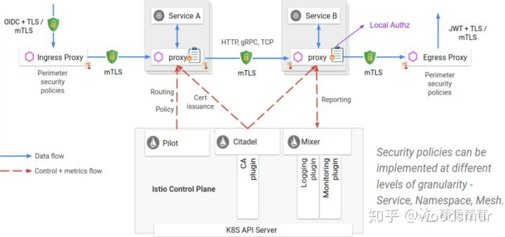
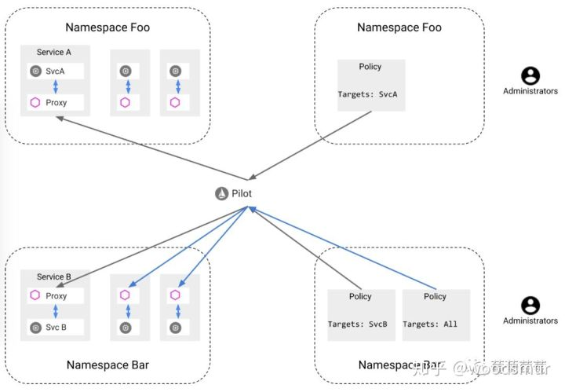

# istio security 之 mTLS





istio mesh 的认证(Authentication)默认采取宽容模式（PERMISSIVE mode），这对暴露出去的 API 是极不安全的，我们可以开启双向 TLS 认证来为 API 提供安全保障。

首先安装 isito 及测试例子（httpbin 和 sleep）。

```text
kubectl apply -f install/kubernetes/istio-demo.yaml
kubectl create ns foo
kubectl apply -f <(istioctl kube-inject -f samples/httpbin/httpbin.yaml) -n foo
kubectl apply -f <(istioctl kube-inject -f samples/sleep/sleep.yaml) -n foo
kubectl create ns bar
kubectl apply -f <(istioctl kube-inject -f samples/httpbin/httpbin.yaml) -n bar
kubectl apply -f <(istioctl kube-inject -f samples/sleep/sleep.yaml) -n bar
kubectl create ns legacy
kubectl apply -f samples/httpbin/httpbin.yaml -n legacy
kubectl apply -f samples/sleep/sleep.yaml -n legacy
```

我们可以打开全局 `mutual TLS` ，来赋予每个服务提供 TLS 的认证来保证安全:

```text
kubectl apply -f - <<EOF
apiVersion: "authentication.istio.io/v1alpha1"
kind: "MeshPolicy"
metadata:
  name: "default"
spec:
  peers:
  - mtls: {}
EOF
```

开通全局 TLS 之后，foo bar 服务之间的互访：

```text
for from in "foo" "bar"; do for to in "foo" "bar"; do kubectl exec $(kubectl get pod -l app=sleep -n ${from} -o jsonpath={.items..metadata.name}) -c sleep -n ${from} -- curl "http://httpbin.${to}:8000/ip" -s -o /dev/null -w "sleep.${from} to httpbin.${to}: %{http_code}\n"; done; done
sleep.foo to httpbin.foo: 503
sleep.foo to httpbin.bar: 503
sleep.bar to httpbin.foo: 503
sleep.bar to httpbin.bar: 503
```

可见，开通全局 TLS 之后，服务之间是不能访问的。

我们可以为某个服务单独配置 `DestinationRule` 来开启双向 TLS，由于 kubernetes 集群中的服务有这样的 DNS：`{servicename}.{namespace}.svc.cluster.local`，我们也可以简单通过通配符 `*.local` 来为集群中的服务开启双向 TLS。

```text
kubectl apply -f - <<EOF
apiVersion: "networking.istio.io/v1alpha3"
kind: "DestinationRule"
metadata:
  name: "default"
  namespace: "istio-system"
spec:
  host: "*.local"
  trafficPolicy:
    tls:
      mode: ISTIO_MUTUAL
EOF
```

以上开启双向 TLS 之后，服务之间可以访问了。

```text
for from in "foo" "bar"; do for to in "foo" "bar"; do kubectl exec $(kubectl get pod -l app=sleep -n ${from} -o jsonpath={.items..metadata.name}) -c sleep -n ${from} -- curl "http://httpbin.${to}:8000/ip" -s -o /dev/null -w "sleep.${from} to httpbin.${to}: %{http_code}\n"; done; done
sleep.foo to httpbin.foo: 200
sleep.foo to httpbin.bar: 200
sleep.bar to httpbin.foo: 200
sleep.bar to httpbin.bar: 200
```

### **非 istio services 到 istio services 的访问**

由于非 istio services 没有 sidecar，无法发起 TLS 连接，所以从非 istio services 到 istio service 的访问会失败：

```text
for from in "legacy"; do for to in "foo" "bar"; do kubectl exec $(kubectl get pod -l app=sleep -n ${from} -o jsonpath={.items..metadata.name}) -c sleep -n ${from} -- curl "http://httpbin.${to}:8000/ip" -s -o /dev/null -w "sleep.${from} to httpbin.${to}: %{http_code}\n"; done; done
sleep.legacy to httpbin.foo: 000
command terminated with exit code 56
sleep.legacy to httpbin.bar: 000
command terminated with exit code 56
```

根据官方的说法，此时除了修改 istio services 的访问权限之外，没有其他有效的办法。开启全局双向 TLS 会给服务迁移到 istio 带来一些不便。

### **istio services 到非 istio services 的访问**

开启了双向 TLS 之后之后，由于非 istio services 没有相应的 sidecar，所以从 istio services 到非 istio services 的访问也会失败：

```text
for from in "foo" "bar"; do for to in "legacy"; do kubectl exec $(kubectl get pod -l app=sleep -n ${from} -o jsonpath={.items..metadata.name}) -c sleep -n ${from} -- curl "http://httpbin.${to}:8000/ip" -s -o /dev/null -w "sleep.${from} to httpbin.${to}: %{http_code}\n"; done; done
sleep.foo to httpbin.legacy: 503
sleep.bar to httpbin.legacy: 503
```

我们可以关闭非 istio services 的 TLS 来解决：

```text
kubectl apply -f - <<EOF
apiVersion: networking.istio.io/v1alpha3
kind: DestinationRule
metadata:
 name: "httpbin-legacy"
 namespace: "legacy"
spec:
 host: "httpbin.legacy.svc.cluster.local"
 trafficPolicy:
   tls:
     mode: DISABLE
EOF
```

关闭非 istio services 的 TLS 之后，服务访问正常：

```text
for from in "foo" "bar"; do for to in "legacy"; do kubectl exec $(kubectl get pod -l app=sleep -n ${from} -o jsonpath={.items..metadata.name}) -c sleep -n ${from} -- curl "http://httpbin.${to}:8000/ip" -s -o /dev/null -w "sleep.${from} to httpbin.${to}: %{http_code}\n"; done; done
sleep.foo to httpbin.legacy: 200
sleep.bar to httpbin.legacy: 200
```

由于这个 `DestinationRule` 应用在 service，它比全局 TLS 的 `DestinationRule` 具有更高的优先级，所以服务级别的 `DestinationRule` 会先生效，全局 `DestinationRule` 会被忽略。

### **istio services 到 kubernetes api server 的访问**

像非 istio services 一样，kubernetes api server 没有 sidecar，所以也需要为 api server 配置 `DestinationRule`:

```text
kubectl apply -f - <<EOF
apiVersion: networking.istio.io/v1alpha3
kind: DestinationRule
metadata:
 name: "api-server"
 namespace: istio-system
spec:
 host: "kubernetes.default.svc.cluster.local"
 trafficPolicy:
   tls:
     mode: DISABLE
EOF
```

之后可以正常访问 `kubernetes.default` 服务了。

```text
TOKEN=$(kubectl describe secret $(kubectl get secrets | grep default-token | cut -f1 -d ' ' | head -1) | grep -E '^token' | cut -f2 -d':' | tr -d '\t' | tr -d ' ')
kubectl exec $(kubectl get pod -l app=sleep -n foo -o jsonpath={.items..metadata.name}) -c sleep -n foo -- curl https://kubernetes.default/api --header "Authorization: Bearer $TOKEN" --insecure -s -o /dev/null -w "%{http_code}\n"
200
```

### **PERMISSIVE 模式**

`istio-demo.yaml` 安装的 `meshpolicies` 是 `PERMISSIVE` 模式:

```text
$ kubectl get meshpolicies -o yaml
apiVersion: v1
items:
- apiVersion: authentication.istio.io/v1alpha1
  kind: MeshPolicy
  metadata:
    annotations:
      kubectl.kubernetes.io/last-applied-configuration: |
        {"apiVersion":"authentication.istio.io/v1alpha1","kind":"MeshPolicy","metadata":{"annotations":{},"labels":{"app":"security","chart":"security","heritage":"Tiller","release":"istio"},"name":"default","namespace":""},"spec":{"peers":[{"mtls":{"mode":"PERMISSIVE"}}]}}
    creationTimestamp: "2019-05-24T08:55:48Z"
    generation: 1
    labels:
      app: security
      chart: security
      heritage: Tiller
      release: istio
    name: default
    resourceVersion: "163264"
    selfLink: /apis/authentication.istio.io/v1alpha1/meshpolicies/default
    uid: b96852af-7e01-11e9-8697-025000000001
  spec:
    peers:
    - mtls:
        mode: PERMISSIVE
kind: List
metadata:
  resourceVersion: ""
  selfLink: ""
```

`PERMISSIVE` 模式允许 service 同时接受纯文本流量和双向 TLS 流量，这个模式为服务向双向 TLS 的迁移提供了很大的方便。

### **namespace 范围的策略**

我们也可以在 namespace 或 service 级别来打开 `mutual TLS`。

在测试 namespace 和 service 级别的策略之前，需要删除一些资源：

```text
kubectl delete meshpolicy default
kubectl delete destinationrules -n bar --all
kubectl delete destinationrules -n foo --all
kubectl delete destinationrules httpbin-legacy -n legacy
kubectl delete destinationrules api-server -n istio-system
```

此时 meshpolicy 回归到 `istio-demo.yaml` 里的 `PERMISSIVE` 模式。

打开 foo namespace 双向 TLS 的策略：

```text
kubectl apply -f - <<EOF
apiVersion: "authentication.istio.io/v1alpha1"
kind: "Policy"
metadata:
  name: "default"
  namespace: "foo"
spec:
  peers:
  - mtls: {}
EOF
```

以及相应的 `DestinationRule` 规则：

```text
kubectl apply -f - <<EOF
apiVersion: "networking.istio.io/v1alpha3"
kind: "DestinationRule"
metadata:
  name: "default"
  namespace: "foo"
spec:
  host: "*.foo.svc.cluster.local"
  trafficPolicy:
    tls:
      mode: ISTIO_MUTUAL
EOF
```

下面测试下三个命名空间服务之间的互通性：

```text
for from in "foo" "bar" "legacy"; do for to in "foo" "bar" "legacy"; do kubectl exec $(kubectl get pod -l app=sleep -n ${from} -o jsonpath={.items..metadata.name}) -c sleep -n ${from} -- curl "http://httpbin.${to}:8000/ip" -s -o /dev/null -w "sleep.${from} to httpbin.${to}: %{http_code}\n"; done; done
sleep.foo to httpbin.foo: 200
sleep.foo to httpbin.bar: 200
sleep.foo to httpbin.legacy: 200
sleep.bar to httpbin.foo: 200
sleep.bar to httpbin.bar: 200
sleep.bar to httpbin.legacy: 200
sleep.legacy to httpbin.foo: 000
command terminated with exit code 56
sleep.legacy to httpbin.bar: 200
sleep.legacy to httpbin.legacy: 200
```

可见 legacy namespace 无 sidecar，导致访问 foo 或 bar 的服务失败。bar namespace 虽然为设置双向 TLS，但是由于设置了 meshpolicy 的 `PERMISSIVE` 模式，也能保证 bar 和 foo 之间的服务的访问。

### **service 范围的策略**

我们可以缩小双向 TLS 应用的范围，即打开某个 service (bar namespace 的 httpbin) 双向 TLS，这里是认证的 `Policy`：

```text
kubectl apply -n bar -f - <<EOF
apiVersion: "authentication.istio.io/v1alpha1"
kind: "Policy"
metadata:
  name: "httpbin"
spec:
  targets:
  - name: httpbin
  peers:
  - mtls: {}
EOF
```

bar namespace httpbin 服务的 `DestinationRule` 规则：

```text
kubectl apply -n bar -f - <<EOF
apiVersion: "networking.istio.io/v1alpha3"
kind: "DestinationRule"
metadata:
  name: "httpbin"
spec:
  host: "httpbin.bar.svc.cluster.local"
  trafficPolicy:
    tls:
      mode: ISTIO_MUTUAL
EOF
```

此时从 legacy 访问 foo 和 bar 两个 namespace 都访问失败。不同的是，foo namespace 是通过命名空间来设置访问策略，而 bar namespace 是通过 service 范围来设置的策略。

```text
for from in "foo" "bar" "legacy"; do for to in "foo" "bar" "legacy"; do kubectl exec $(kubectl get pod -l app=sleep -n ${from} -o jsonpath={.items..metadata.name}) -c sleep -n ${from} -- curl "http://httpbin.${to}:8000/ip" -s -o /dev/null -w "sleep.${from} to httpbin.${to}: %{http_code}\n"; done; done
sleep.foo to httpbin.foo: 200
sleep.foo to httpbin.bar: 200
sleep.foo to httpbin.legacy: 200
sleep.bar to httpbin.foo: 200
sleep.bar to httpbin.bar: 200
sleep.bar to httpbin.legacy: 200
sleep.legacy to httpbin.foo: 000
command terminated with exit code 56
sleep.legacy to httpbin.bar: 000
command terminated with exit code 56
sleep.legacy to httpbin.legacy: 200
```

从例子中我们还可以看出，Policy 主要应用于 namespace，DestinationRule 主要应用于 service，而且 DestinationRule 的优先级会比 Policy 高。