# 云计算虚拟化：看这一篇就够了！

先声明一下，本节以及之后的几节都是作者学习Redhat的网络虚拟化的心得。比较性急的读者可以直接点击:

https://www.redhat.com/en/blog/introduction-virtio-networking-and-vhost-net

https://www.redhat.com/en/blog/deep-dive-virtio-networking-and-vhost-net

https://www.redhat.com/en/blog/hands-vhost-net-do-or-do-not-there-no-try

虚拟化三元素：

对于网卡来讲，在一个虚拟化的环境中，一个或者多个VM都是跑在一台物理机的，这些VM也有独立的操作系统，而这些操作系统是通过一个hypervisor跑在物理机的操作系统上。同时，这个物理机要提供相应的资源给VM，比如它会提供一个虚拟的网卡给VM，VM会把它当作一个真实的物理网卡。这里面就涉及了三个部分：

KVM

kernel based的VM可以使Linux像一个hypervisor一样工作。这个模块为linux提供一个了hyervisor所必须的功能，而那些例如：内存管理，调度，网络协议栈等功能都是由linux的kernel提供的。这些VM就像在linux标准的进程调度器管理下的用户态进程，唯一的不同是它们独占的虚拟硬件设备。

QEMU

一个运行在host 用户空间的虚拟机监控进程，通过仿真，它为VM机提供一系列的不同的硬件和设备接口。QEMU和KVM一起可以提供给VM近似与真实硬件的性能。一个Guest 可以通过 CLI 对于QEMU进行配置。

Libvirt 

一个可以把基于XML格式的配置信息转换成QEMU的CLI。它同时提供一个管理的守护进程来管理子进程，诸如qemu， 因此qemu就不需要root的权限了。因此在 Openstack Nova, 它可以创建一个VM的时候，通过libvrit创建一个qemu进程给VM，对于每个VM，可以分别创建qemu进程给它。

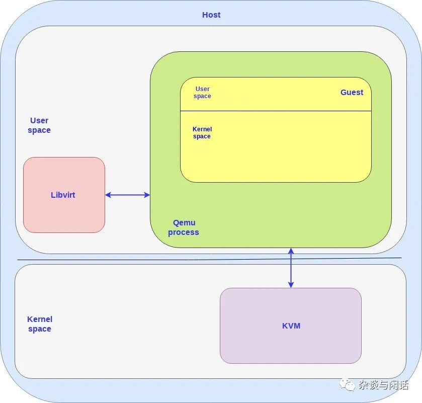

因此，在这个框图中，需要注意的地方：

1. 对于host和guest都有用户态和核心态。
2. 对于guest上的OS，都是跑在Qemu这个用户态的进程上。
3. 对于Host来讲，有几个VM就要有几个Qemu进程，libvrit可以和他们交互。

在上图中，可以看到CPU的虚拟化都是由Qemu和KVM配合实现，虚拟机管理是libvirt实现的，但是I/O的虚拟化基本都是由原有的Host的kernel协议栈实现的。这个就是一切问题的起源。

I/O stack 本来就比较慢，对于Linux kernel network stack来讲，缺省的pps也就是350K[1]，通过利用网卡的多队列和CPU的多线程的操作，可以最终到1Mpps。对于disk I/O来讲，用过HBA+SSD配置的同学都知道Linux block I/O stack的overhead。 对于NVMe SSD，IRQ成为相对比较大的overhead。

同时原有的Qemu的networking的是基于file的TAP/TUN接口。[2]

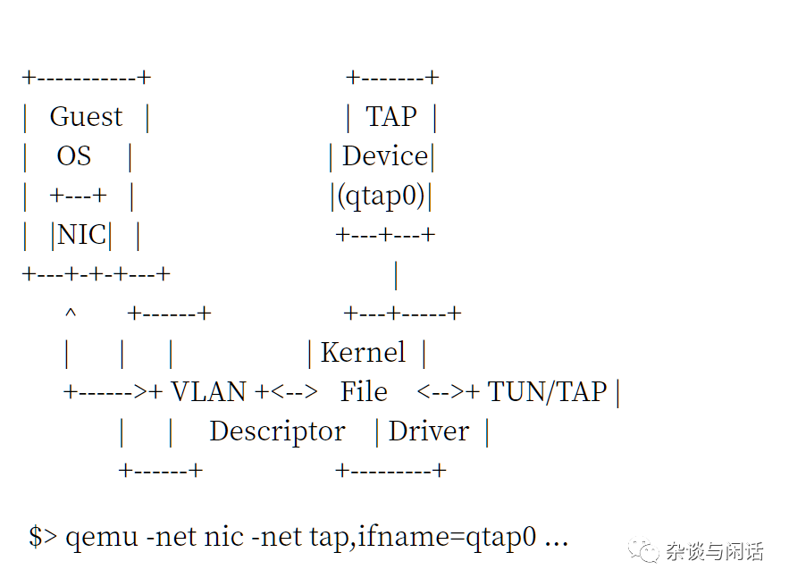

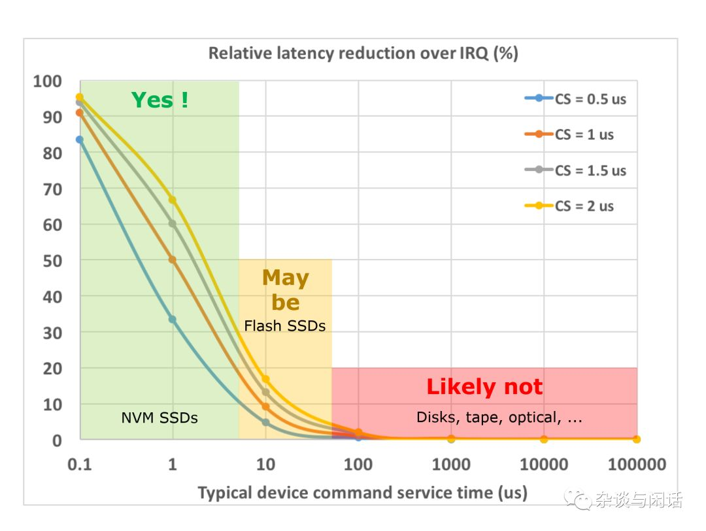

大家要注意的是，这样slow的堆栈，我们要走两次，两次，两次。

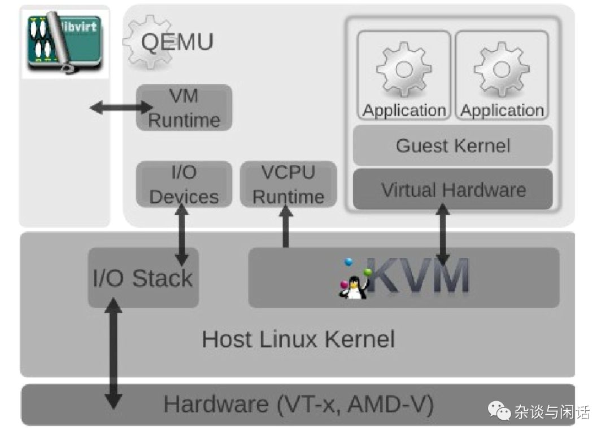

怎么办呢，缺省的KVM的I/O stack实在是不能用，性能和CPU的消耗都是问题。这个时候，大家想到了CPU虚拟化中的演进过程，从全指令模拟到半虚拟化。这个时候，Virtio接口就闪亮登场了。[2]

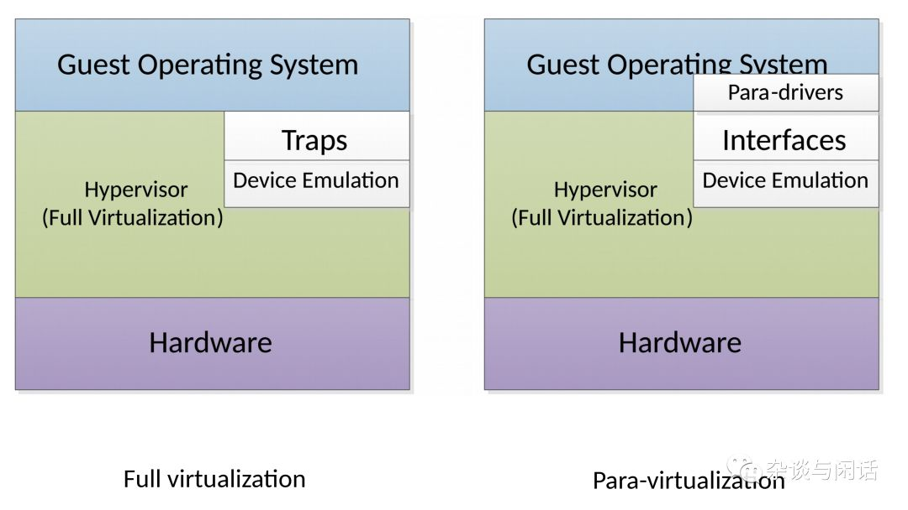

VirtIO

VirtIO定义可控制路径和数据路径，控制路径的功能是在Host和Guest之间建立和清除数据路径。而数据路径就是关注在host和guest之间的package的负载的传输。分两个路径也就是意味着是不同的路径。控制路径需要的是可管理和灵活性，数据路径要求的就是性能。Virtio的规范可以分为两个部分：

1. virtio spec - The virtio spec, which is maintained by OASIS, defines how to create a control plane and the data plane between the guest and host. For example the data plane is composed of buffers and rings layouts which are detailed in the spec.
2. vhost protocol - A protocol that allows the virtio dataplane implementation to be offloaded to another element (user process or kernel module) in order to enhance performance.

Virtio的控制路径就在Qemu的进程中按virtio 的规范实现了，但是数据路径不能这么做，因为每次数据从Guest OS到Host OS都需要上下文切换，代价太大了。因此数据路径必须要bypass Qemu。

Vhost的目的就是实现一个从host kernel 到Guest的直通路径，从而bypass Qemu进程。Vhost协议定义了如何去建立数据路径，但是如何去实现并没有严格规定，这个实现取决于host和Guest上ring的layout和数据buffer的描述以及数据报的发送和接受机制。

Vhost因此可以在Kernel中实现（vhost-net）,也可以在用户态实现（vhost-user).

我们先来看看vhost-net/virtio-net 实现. 

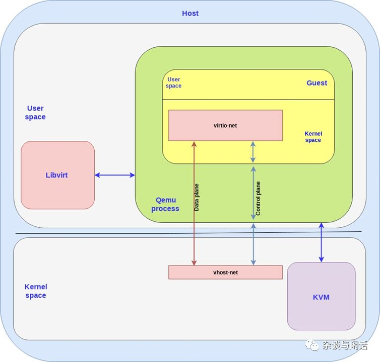

在本图中，Virtio后端接口就是跑在host的kernel上的vhost-net,Virtio前端接口就是跑在Guest Kernel上的Virtio-net。

在前端和后端之间我们有数据路径和控制路径。控制路径如上图的蓝色，在vhost-net的kernel驱动和qemu的进程中以及guset 的virtio-net。vhost-net是遵循vhost协议规范在host 和guest的kernel之间基于共享内存区域建立了一个直接的数据通道。

为了性能，因为virtio本身就是queue的定义，为了性能实现了多队列。[3]

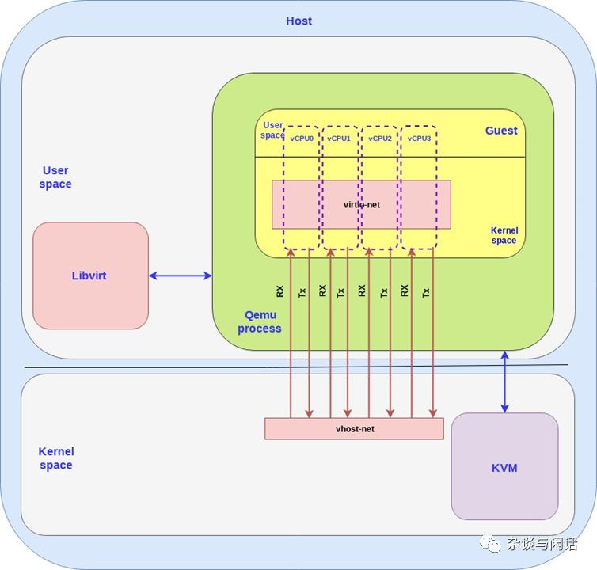

到目前为止，我们讨论的都是guest如何把数据发送到hots kernel，这个只是VM和PM之间数据，对于真正的云计算环境，大家需要解决的还有，一个PM上的VMs的数据以及两个不同的PM上的VM的数据问题，这个时候OVS就出现了。

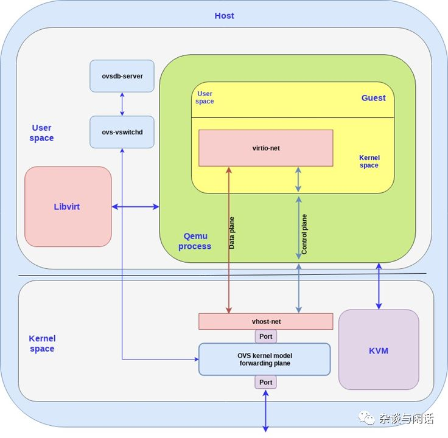

可以看到，OVS和vrtio-networking的实现包含了两个部分：

1.  Host的用户态，实现了ovsdb 的数据库，以及管理vswitch的守护进程。
2. Host的kernel，通过ovs kernel驱动实现了数据路径以及转发路径。

OVS控制器和数据库服务器以及host kernel的转发通路通讯。我们使用linux的port机制使网络封包进出OVS。在上图中，我们使用一个port连接物理网络和OVS的kernel转发路径，另一个连接Virtio-networking的后端vhost-net。要注意，在现实的情况下，我们可以有多个网卡通过多个port连接到OVS，同时多个虚拟机可以有多个后端vhost-net连接到OVS。

到目前位置，我们还在复习总结，这都是目前经典的KVM+Qemu+Virtio+OVS的结构，估计使用的人应该已经不多了。但在向用户态的DPDK前进之前，我们还应该在deep dive一下。

# Deep dive into Virtio-networking and vhost-net

Networking

在我们的讨论中，物理网卡就是一个真实的物理设备帮助计算机连接外部世界，它可能有一些CPU的卸载功能，和之前讲的offload网卡一样，支持TSO，LSO等等。

在linux网络里面，还有虚拟网络的概念TUN/TAP，他们提供了点到点的网络连接，用户空间的应用可以用它交换网络封包。TAP是可以支持L2的以太帧的设备，TUN是可以支持L3的IP 封包。

当tun的linux kernel模块加载之后，它会创建一个/dev/net/tun设备。一个进程可以创建一个tap设备并打开它，使用ioctl接口进行操作。一个新的tap设备会在/dev 文件系统中创建一个设备名，其他进程可以访问它，发送或接受以太帧。

#### IPC, System programming

Inter-processes communcation 这个是unix编程的老朋友，在和Qemu和Vhost结合的部分，如果看代码的话看一看到就是eventfd模式。[5]最常使用的就是实现一个事件驱动的线程池。当然，eventfd的文件句柄也可以有更多的模式，如poll，select，epoll以及被写入而notified （callback）。

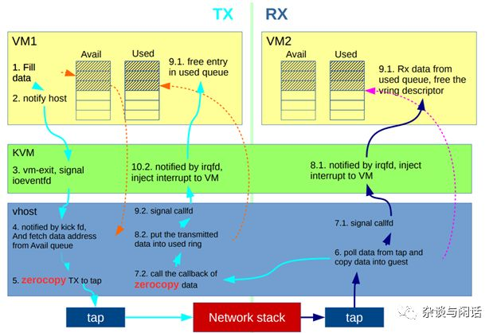

这个就是KVM和Qemu基于IPC的网络通讯机制。[6]

Qemu和设备模拟

qemu虽然在host看来只是一个普通的进程，包含了自己的内存空间。但是在Guest虚拟机看来，Qemu提供的内存空间就是它的物理内存。

对于Host来讲，和真实的物理设备进行交互I/O的时候，都需要执行特殊的指令和访问预先分配好的内存地址空间。因此当qemu想访问这段空间的时候，控制权需要回到qemu，它通过设备模拟的方式提供接口给guest。

Virtio Spec device/driver

virtio的规范包含两个重要的元素：设备和驱动。在一个常见的部署中，hypervisor通过一定的机制把virtio 设备暴露给guest。从Guest看来，这些设备就是它的物理设备。

比较常用的机制就是PCI或者PCIE 总线。当然，也可以通过MMIO的方式把设备放在预定义的Guest的内存地址。这个Guest OS看到的物理设备可以完全是虚拟化的（没有host物理设备对应）或者只是对应一个设备的接口。

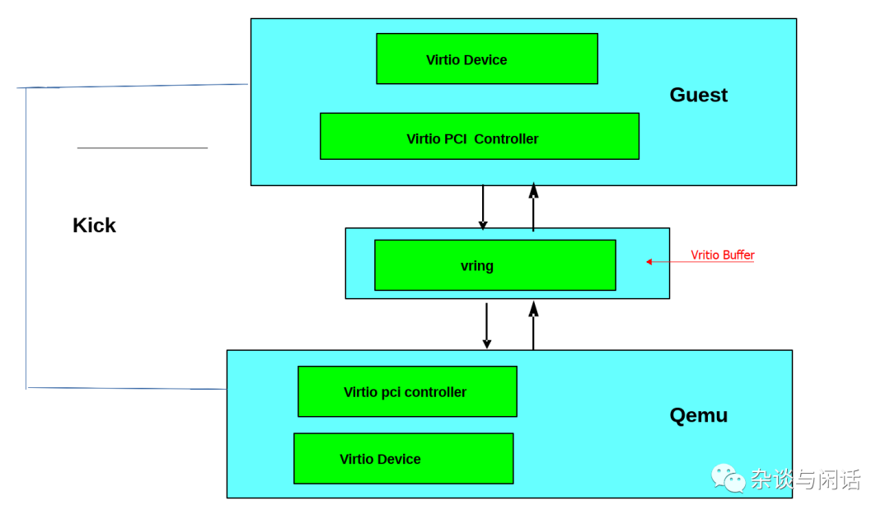

把设备通过PCI prot 暴露的好处是利用了pci的广泛使用的优势。真正的物理PCI设备都有一段内存空间来放置配置空间，驱动可以通过这段地址空间读写PCI设备的寄存器。在虚拟化中，hypervios会拦截对这些地址空间的访问并进行设备模拟，提供像物理机一样的对应的内存地址空间内容以及访问应答。virtio 协议就是定义了这些PCI的配置空间。

当Guest 启动并进行PCI/PCIe的初始化时候，virtio设备就会提供对应的pci 厂商ID和设备ID，guest OS就会调用对用的驱动进行交互，这里就是virtio的驱动。

Virtio IO的驱动必须分配一段内存区域，hyperviosr和这个virtio设备都可以访问，一般的机制就是共享内存。之前我们讲的数据路径就是利用这些内存区域进行数据搬运，而控制路径就是设置和维护这个内存区域。

Vritio Sepc Virtqueue

每一个virtio设备都有0或者n个virtqueue。virtqueue本身是由一系列guset分配的buffer组成，这些buffer同样可以被host进行读写访问。Virtio协议同时也定义了双向的notification机制。

- Available Buffer Notification: Used by the driver to signal there are buffers that are ready to be processed by the device

- Used Buffer Notification: Used by the device to signal that it has finished processing some buffers.

  用PCI设备举例，guest可以通过写一个特殊的内存地址发送一个available buffer notification，而virtio设备可以使用vCPU的中断发送一个used buffer notification。

  当然这个notification机制可以被动态的禁止，这样virtqueue就可以使用polling机制了，这个会在下章的DPDK中详细解释。

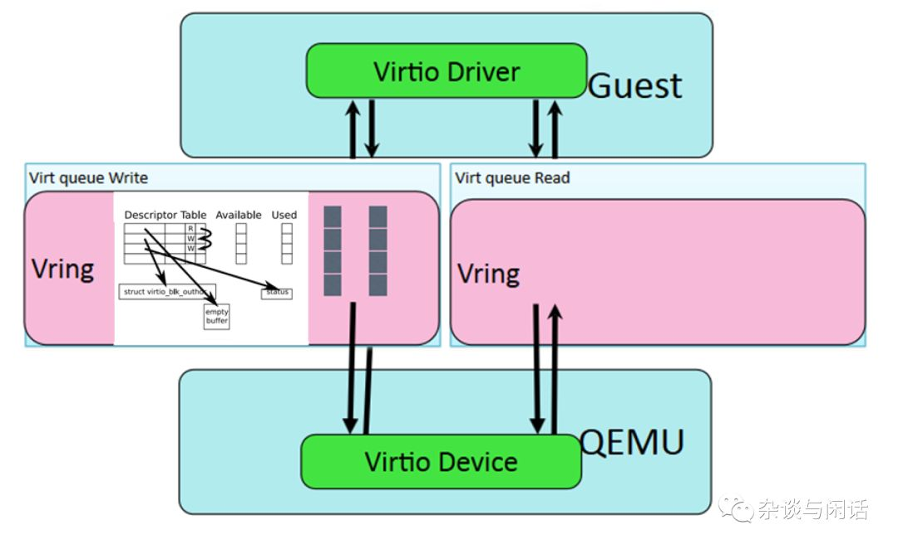

关于Virtio设备的接口，总结一下：

- Device’s feature bits (which device and guest have to negotiate)
- Status bits
- Configuration space (that contains device specific information, like MAC address)
- Notification system (configuration changed, buffer available, buffer used)
- Zero or more virtqueues
- Transport specific interface to the device

virtio-net on qemu

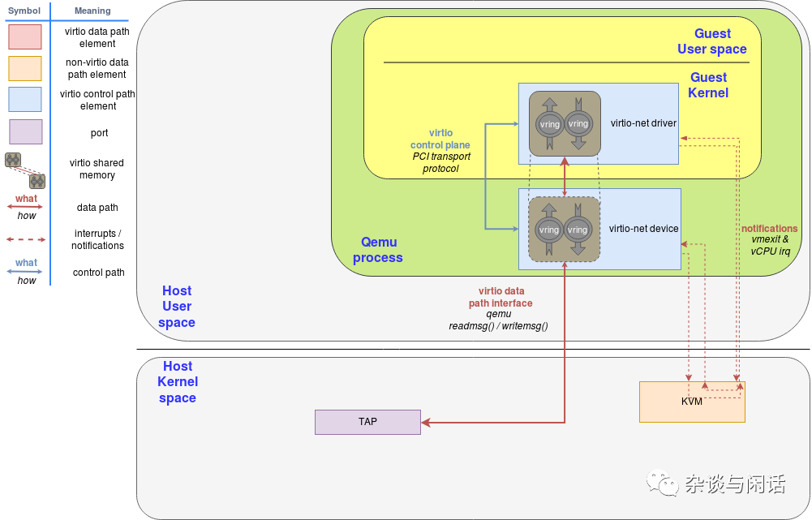

Qemu virtio sending buffer flow diagram

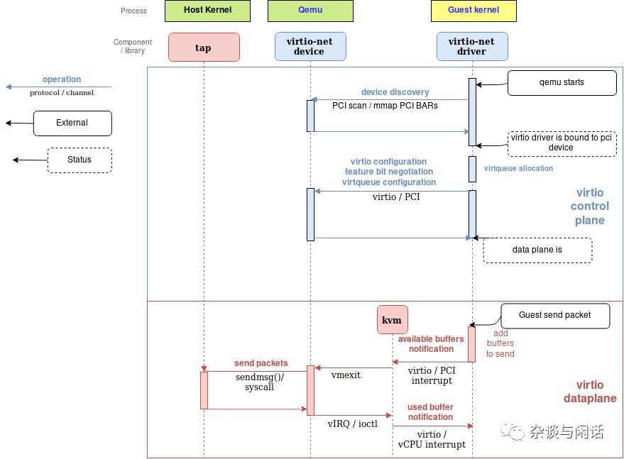

这个两张图把整个流程解释得已经很清楚了。需要注意的点是：

\1. 有额外的virtqueue不在数据路径上，只是用来提供virtio-net驱动和设备之间的通讯，它可以提供一些控制功能，比如高级过滤功能，设置MAC地址以及active的queue的数量。要知道，virtio设备和真正的物理网卡一样可以提供卸载功能，它可以通知guest OS，只要下面由host的设备来实现就行。

 \2. vritio-buffer也就是virtqueue中的buffer是由virtio的驱动申请并映射到virtio设备。这些设备应该在hyervisor中，因此hyperviosr可以访问guest的这部分buffer进行读写操作。

Vhost协议

在上面的virtio的实现机制中，有几个可以提升的地方：

1. 当Guest发送available buffer notification的时候，vCPU要stop，控制器回到hypervisor这边，这个是需要上下文切换的。
2. Qemu自身的task/thread的同步机制。
3. 通过TAP的package没有batch的机制，每个package都需要syscall和数据copy
4. 通过vCPU的中断发送available buffer notification
5. 额外的syscall用来恢复vCPU的运行，

vhost就是用来解决这些问题。vhost协议API本质上是基于消息的，它可以帮助hyperviosr把数据路径的操作卸载给其他的机制（handler）可以更加高效地完成。通过这个协议，master可以把下列信息发送给其他handler

- Hyperviosr的memory 布局，这样其他的handler可以定位virtqueue和buffer在hypervisor内存中的位置。
- 一对文件描述符，根据vritio协议发送或接受notification。这些文件描述符被KVM和handler共享，因此他们之间的通讯可以不经过hypervisor，从而做到bypass hypervisor。从而数据路径的处理就完全由这个handler来处理了，这个handler可以直接访问virtqueue的memory地址空间，又可以在guest之间收发notification。

vhost 的消息机制可以使用任意的host-local 通讯机制，比如sockets或者字符设备，或者和hypervisor可以使用server/client机制。

下面我们来分析一下vhost在kernel中的一个实现vhost-net.

vhost-net kernel implamentation 

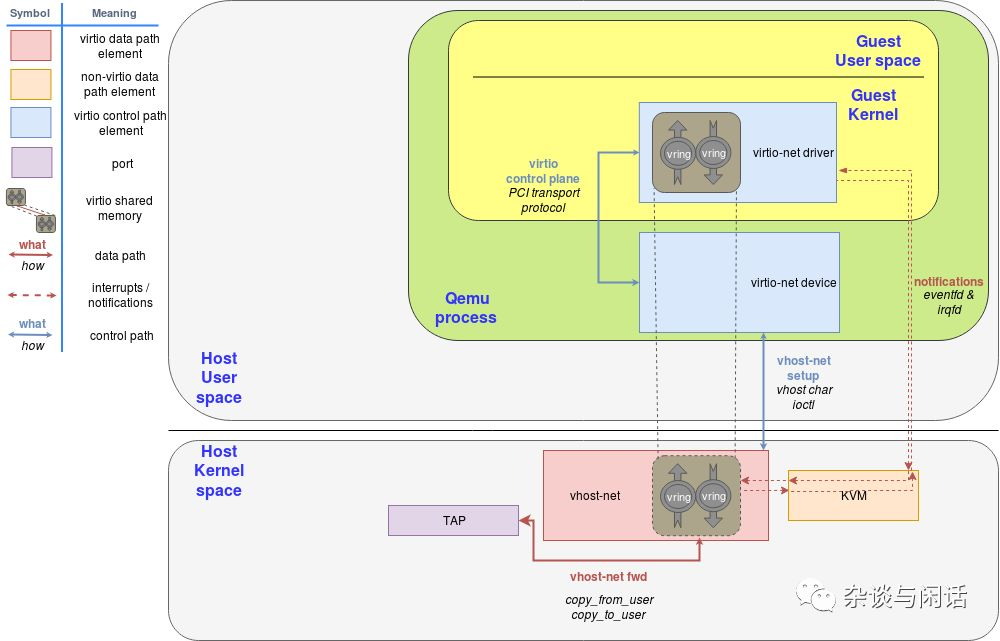

vhost-net sending buffer diagram flow

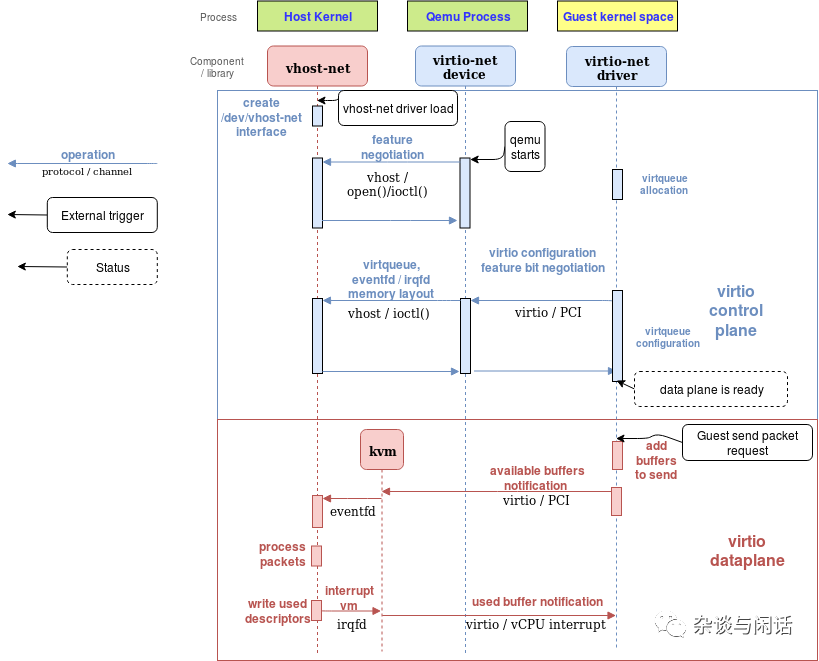

和之前没有vhost的框图一样，上面两图解释了vhost的作用，在数据路径上减少了上下文切换。同时:

1. qemu和vhost-net的handler通过ioctl进行vhost的消息交换，使用基于eventfd的irqfd和ioeventfd进行notification的处理。
2. 初始化之后，vhost会创建vhost-$pid进程，$pid就是hpyervisor的进程。
3. qemu会分配一个eventfd并且在vhost和KVM进行注册。vhost-$pid内核进程polls这个fd，当guest写一个特殊的位置的时候，kvm会写这个fd。这个机制就是ioeventfd。这样，一个简单的guest特殊位置的读写操作就不会引起qemu进程的苏醒操作，而直接路由到vhost-$pid进行处理。同时的好处是，这个操作基于fd的消息机制，不需要vCPU stop等待，这样就避免了vCPU的切换。
4. qemu分配了另一个eventfd也注册在vhost和KVM，用来直接插入vCPU的中断，叫irqfd，通过写它，可以允许任何的host上的进程都产生一个vCPU的中断。同样可以较少上下文切换。

和之前一样，使用OVS（标准）添加包的路由功能。

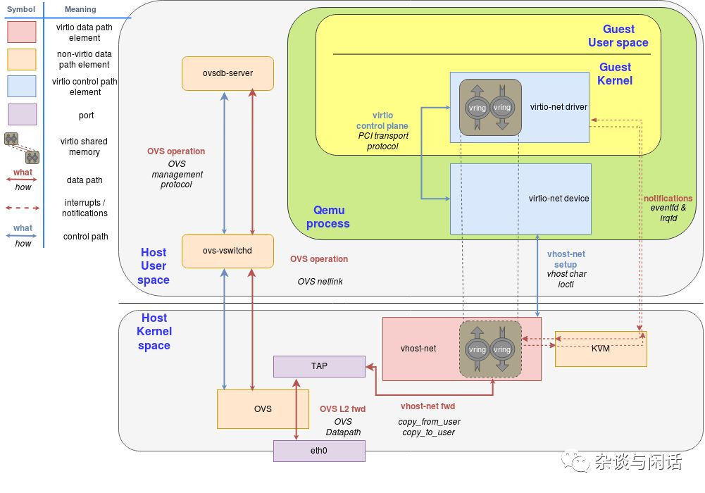

到这里，virtio-net/vhost-net的部分结束了，它定义了基于open-source的软件接口，后面的工作基本都在考虑如何提升它的性能了。从2016年开始，大家的KVM虚拟化的I/O stack的演进开始了。

对，下一节就是DPDK。

[1]https://blog.cloudflare.com/how-to-receive-a-million-packets/

[2] https://people.gnome.org/~markmc/qemu-networking.html

[3]https://www.linux-kvm.org/page/Virtio

[4]https://www.linux-kvm.org/page/Multiqueue

[5]https://zhuanlan.zhihu.com/p/40572954

[6]https://medium.com/@jain.sm/network-packet-flow-in-kvm-qemu-dc79db719078

1. [【翻译】QEMU内部机制：宏观架构和线程模型](https://www.cnblogs.com/qxxnxxFight/p/11050159.html)
2. [【翻译】QEMU内部机制：vhost的架构](https://www.cnblogs.com/qxxnxxFight/p/11046855.html)
3. 【[翻译】QEMU内部机制：顶层概览](https://www.cnblogs.com/qxxnxxFight/p/11058132.html)
4. [【翻译】QEMU内部机制：内存](https://www.cnblogs.com/qxxnxxFight/p/11077472.html)